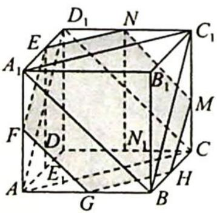
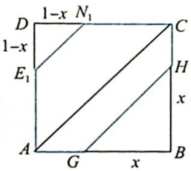
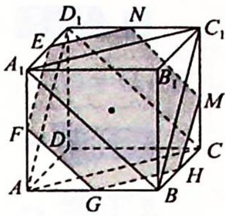
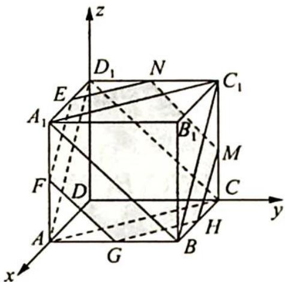
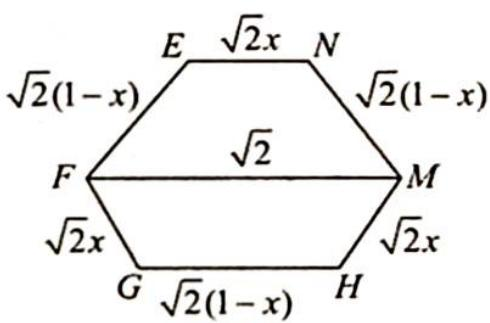
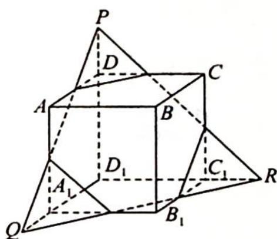

> [!faq]- 《高考数学培优40讲》例题解析
>
> > [!success]- **【答案】** A
>
> > [!note]- **【分析】**
> > 分析 ▶ 思路一:根据正方体的“对称性”,确定所求截面在平面 $ACD_{1}$ 与平面 $A_{1}C_{1}B$ 之间,利用截面在底面上的射影求截面的面积.
> >
> > 思路二:根据极限思想确定经过中心 O 时截面面积最大,此时截面为正六边形.
> >
> > 思路三:根据空间向量在立体几何中的应用,将线面角问题转化为直线与平面法线的夹角问题,即找平面的法线,使其与所有棱所在直线所成角都相等.
> >
> > 思路四: 将截面进行延展, 得到等边三角形 PQR, 根据截面面积和等边三角形面积的比值求截面的面积.
>
> > [!note]- **【解析】**
> > 解析 ▶ 解法一: 因为 $A_{1}B_{1} \parallel D_{1}C_{1} \parallel DC \parallel AB, AA_{1} \parallel BB_{1} \parallel CC_{1} \parallel DD_{1}, A_{1}D_{1} \parallel B_{1}C_{1} \parallel BC \parallel AD$ , 所以根据正方体的“对称性”可知每条棱所在直线与平面 $\alpha$ 所成角相等, 等价于直线 $DA, DC, DD_{1}$ 与平面 $\alpha$ 所成角相等.
> > 根据上述可联想到正三棱锥 $D - ACD_{1}$ , 故平面 $\alpha //$ 平面 $ACD_{1}$ . 同理, 平面 $A_{1}C_{1}B$ 也符合题意, 面积最大的截面一定在平面 $ACD_{1}$ 与平面 $A_{1}C_{1}B$ 之间.
> > 如图1所示,设截面 $\alpha$ 与各棱交点分别为 $G, H, M, N, E, F$ , 则利用面积射影法可得二面角 $E - GH - D$ 的余弦值 $\cos \theta = \frac{\sqrt{3}}{3}$ .
> > 过 $E$ 作 $EE_{1} \perp AD$ , 垂足为 $E_{1}$ , 过 $N$ 作 $NN_{1} \perp DC$ , 垂足为 $N_{1}$ , 截面 GHMNEF 在底面 ABCD 内的射影为 $GHCN_{1}E_{1}A$ , 如图 2 所示. 由射影面积法可知射影面积 $S_{0}$ 与截面面积 $S$ 的比值为 $\frac{\sqrt{3}}{3}$ , 所以 $S = \sqrt{3} S_{0}$ .
> > 设 $BG = x$ ，则 $BG = BH = AE_{1} = CN_{1} = x, DE_{1} = DN_{1} = 1 - x$ ，所以 $S_{0} = 1 - S_{\triangle BGH} - S_{\triangle DE_{1}N_{1}} = 1 - \frac{1}{2} x^{2} - \frac{1}{2}(1 - x)^{2} = -x^{2} + x + \frac{1}{2} = -\left(x - \frac{1}{2}\right)^{2} + \frac{3}{4}$ ，当 $x = \frac{1}{2}$ 时， $S_{0}$ 有最大值为 $\frac{3}{4}$ ，此时 $S_{\max} = \sqrt{3} S_{0} = \frac{3\sqrt{3}}{4}$ . 故选 A.
> > 
> > 图1
> > 
> > 图 2
> > 解法二:如图3所示,截面 $\alpha$ 只要与 $\triangle ACD_{1}$ 和 $\triangle A_{1}BC_{1}$ 所在平面平行就是符合题意的.应当确定的是满足题意的平面 $\alpha$ 有无数个,不妨设平面 $\alpha$ 是由平面 $ACD_{1}$ (或平面 $A_{1}BC_{1}$ ) 沿正方体的体对角线 $DB_{1}$ 平行移动而形成的,可以把过顶点 D 或 $B_{1}$ 时的平面 $\alpha$ 理解成截面面积是 0的极端特殊情形. 再利用正方体的对称性确定平面经过中心 O 时截面面积为最大, 此时截面是由六条棱 $D_{1}A_{1}, A_{1}A, AB, BC, CC_{1}, C_{1}D_{1}$ 的中点连线而成的正六边形 EFGHMN, 其边长为 $\frac{\sqrt{2}}{2}$ , 此时截面面积为 $6 \times \frac{\sqrt{3}}{4} \times \left(\frac{\sqrt{2}}{2}\right)^{2} = \frac{3\sqrt{3}}{4}$ . 故选 A.
> > 
> > 解法三:如图4所示,在空间直角坐标系D-xyz中,正方体的体对角线
> > DB₁所在直线和所有棱所在的直线夹角相等(正方体是非常特殊的几何体之一,且有一定的对称性,其中体对角线所在直线即为“对称轴”,且DB₁⊥平面ACD₁,DB₁⊥平面A₁BC₁).利用数学运算的方法,即将问题转化为如图5所示的平面图形的面积计算.
> > 
> > 图4
> > 
> > 图 5
> > 设 CM = x，则截面面积 $S = \frac{1}{2}(\sqrt{2}x + \sqrt{2}) \cdot \frac{\sqrt{6}}{2}(1 - x) + \frac{1}{2}\left[\sqrt{2}(1 - x) + \sqrt{2}\right] \cdot \frac{\sqrt{6}}{2}x = \frac{\sqrt{3}}{2}(-2x^{2} + 2x + 1) = -\sqrt{3}\left[\left(x - \frac{1}{2}\right)^{2} - \frac{3}{4}\right], x \in (0,1)$ .
> > 所以当 $x=\frac{1}{2}$ 时, 截面面积 S 取最大值为 $\frac{3\sqrt{3}}{4}$ . 故选 A.
> > 解法四:利用正方体的对称性确定平面经过中心 O 时截面面积为最大,如图 6 所示,将截面进行延展,得到等边三角形 PQR,此时正六边形的顶点为正三角形边长的三等分点,所以截面面积 $S=\frac{2}{3}S_{\triangle PQR}=\frac{2}{3}\times\frac{\sqrt{3}}{4}\times\left(\frac{3\sqrt{2}}{2}\right)^{2}=\frac{3\sqrt{3}}{4}$ . 故选 A.
> > 
> > 图6
