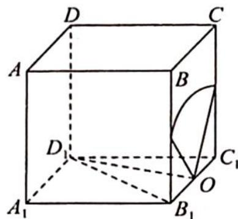
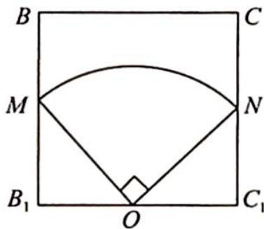

> [!faq]- 《高考数学培优40讲》例题解析
>
> > [!success]- **【答案】** 详见解析
>
> > [!note]- **【分析】**
> > 分析 ▶ 将平面与球面的交线转化至平面内求解.
>
> > [!note]- **【解析】**
> > 解析 ▶ 由球体的性质知侧面 $BCC_{1}B_{1}$ 所在平面与球面的公共部分是小圆的一段圆弧,该截面小圆的圆心为 $B_{1}C_{1}$ 的中点,如图 1 所示.
> > 
> > 因为直四棱柱 $ABCD-A_{1}B_{1}C_{1}D_{1}$ 所有棱长为 2， $\angle BAD=60^{\circ}$ ，所以 $\triangle B_{1}C_{1}D_{1}$ 为等边三角形，则 $D_{1}O\perp B_{1}C_{1}, D_{1}O\perp$ 平面 $BCC_{1}B_{1}$ .
> > 图1
> > 易知 $D_{1}O = \sqrt{3}$ ，因为球的半径为 $\sqrt{5}$ ，所以截面圆半径 $r = \sqrt{R^2 - d^2} = \sqrt{5 - 3} = \sqrt{2}$ ，故球面
> > $$
> > B C C _ {1} B _ {1}
> > $$
> > $$
> > B C C _ {1} B _ {1}
> > $$
> > $$
> > \sqrt {2}
> > $$
> > 
> > 在正方形 $BCC_{1}B_{1}$ 中，以 $O$ 为圆心， $\sqrt{2}$ 为半径作弧，如图2所示，易知 $\widehat{MN}$ 是 $\frac{1}{4}$ 个圆，故 $\widehat{MN}$ 的长为 $\frac{1}{4} \times 2\pi r = \frac{\sqrt{2}}{2}\pi$ ，即球面与侧面 $BCC_{1}B_{1}$ 的交线长为 $\frac{\sqrt{2}}{2}\pi$ 。
> > 图 2
> > 本题通过球面与平面交线长的计算,考查学生空间想象能力、逻辑推理能力及运算求解能力,考查核心是球体的截面性质.
