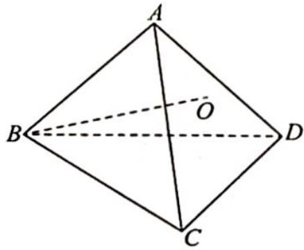
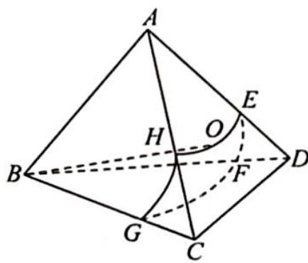

> [!faq]- 《高考数学培优40讲》例题解析
>
> > [!success]- **【答案】** 详见解析
>
> > [!note]- **【分析】**
> > 本题未单列分析。
>
> > [!note]- **【解析】**
> > 
> > 解析 如图所示,轨迹为曲线 EFGH,因为在正三棱锥 A-BCD 中,底面边长为 $\sqrt{6}$ ,侧面均为等腰直角三角形,故 $AB=\sqrt{3}$ .
> > 在 $\triangle ABH$ 中,因为 $BH=2,AB=\sqrt{3},\angle BAH=90^{\circ}$ ,所以 $\angle ABH=\frac{\pi}{6},AH=1,\angle CBH=\frac{\pi}{4}-\frac{\pi}{6}=\frac{\pi}{12}$ ,故 $\widehat{EF}=\widehat{GH}=\frac{\pi}{12}\times2=\frac{\pi}{6}$ ,又 $AH=AE=1,\angle CAD=\frac{\pi}{2}$ ,所以 $\widehat{HE}=\frac{\pi}{2},\widehat{GF}=\frac{\pi}{3}\times2=\frac{2\pi}{3}$ .
> > 
> > 则点 O 的轨迹长度为 $2 \times \frac{\pi}{6} + \frac{\pi}{2} + \frac{2\pi}{3} = \frac{3\pi}{2}$ .
