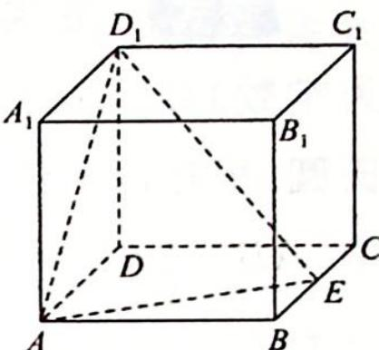
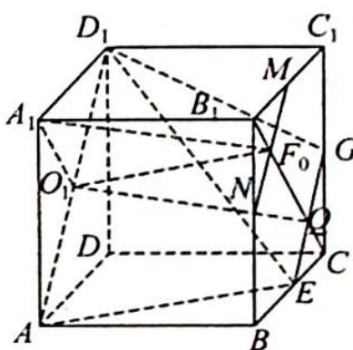

> [!faq]- 《高考数学培优40讲》例题解析
>
> > [!success]- **【答案】** D
>
> > [!note]- **【分析】**
> > 本题未单列分析。
>
> > [!note]- **【解析】**
> > 
> > 解析 如图所示, 取 $CC_{1}$ 的中点 $G$ , 连接 $EG, D_{1}G$ . 设 $B_{1}C_{1}, B_{1}B, C_{1}C$ 的中点分别为 $M, N, G$ , 连接 $MN, B_{1}C$ 且 $MN$ 交 $B_{1}C$ 于 $F_{0}$ .
> > 设 $B_{1}C \cap EG = Q$ ，侧面 $ADD_{1}A_{1}$ 的中心为 $O_{1}$ ，连接 $O_{1}Q, A_{1}F_{0}, A_{1}O_{1}$ ，易知 $A_{1}O_{1} \parallel F_{0}Q$ ，则四边形 $A_{1}O_{1}QF_{0}$ 为平行四边形，所以 $A_{1}F_{0} \parallel O_{1}Q$ ，又 $O_{1}Q \subset$ 平面 $AEGD_{1}, A_{1}F_{0} \not\subset$ 平面 $AEGD_{1}$ ，因此 $A_{1}F_{0} \parallel$ 平面 $AEGD_{1}$ .
> > 
> > 又 $MN \parallel$ 平面 $AEGD_{1}, MN \cap A_{1}F_{0} = F_{0}, MN, A_{1}F_{0} \subset$ 平面 $A_{1}MN$ , 故平面 $A_{1}MN \parallel$ 平面 $AEGD_{1}$ , 则动点 $F$ 的运动轨迹是线段 $MN$ .
> > 设 $A_{1}F$ 与平面 $BCC_{1}B_{1}$ 所成角的正切值为 $t$ , 则 $t = \frac{A_{1}B_{1}}{B_{1}F} = \frac{1}{B_{1}F}$ , 又 $B_{1}F \in \left[\frac{\sqrt{2}}{4}, \frac{1}{2}\right]$ , 所以 $t \in [2, 2\sqrt{2}]$ .
> >
> > 故选 **D**.
