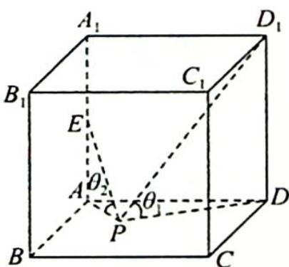

> [!faq]- 《高考数学培优40讲》例题解析
>
> > [!success]- **【答案】** B
>
> > [!note]- **【分析】**
> > 分析 ▶ 使用投影得到平面角,根据两角的正切值可得点 P 到点 A 和点 D 的距离成比例,故点 P 的轨迹为圆.
>
> > [!note]- **【解析】**
> > 解析 如图所示, 连接 $PD, PA$ , 则 $PD_{1}$ 与底面所成角的平面角 $\theta_{1}$ 即为 $\angle D_{1}PD$ , $PE$ 与底面所成角的平面角 $\theta_{2}$ 即为 $\angle EPA$ .
> > 不妨设正方体的棱长为 1, 则 $\tan \theta_{1} = \frac{DD_{1}}{PD}, \tan \theta_{2} = \frac{AE}{PA}$ , 由 $\theta_{1} = \theta_{2}$ 得 $PA = \frac{1}{2} PD$ , 故点 $P$ 的轨迹为圆 (阿波罗尼斯圆). 故选 B.
> > 
> > 在本题中由于点 $P$ 在一个平面上运动, 且满足 $PA = \frac{1}{2} PD$ , 所以其轨迹为阿波罗尼斯圆. 阿波罗尼斯圆的概念可拓展到空间, 即在空间中, 动点 $P$ 到两定点 $A, B$ 的距离满足 $PA = \lambda PB (\lambda > 0, \lambda \neq 1)$ , 可以看作阿波罗尼斯球. 这便是阿波罗尼斯圆的三维空间版本.
