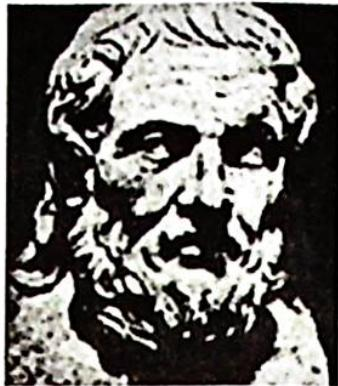
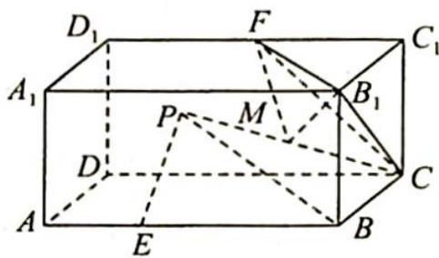
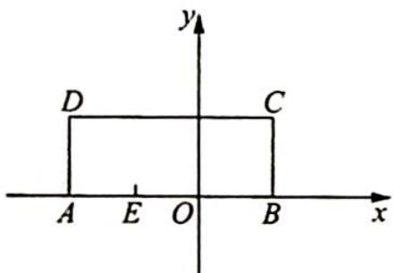
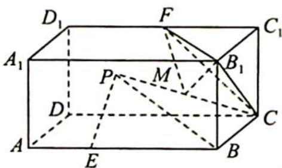

> [!faq]- 《高考数学培优40讲》例题解析
>
> > [!success]- **【答案】** 详见解析
>
> > [!note]- **【分析】**
> > 本题未单列分析。
>
> > [!note]- **【解析】**
> > 
> > 阿波罗尼斯
> > 若点 P 在平面 ABCD 内运动, 则点 P 所形成的阿氏圆的半径为 \_\_\_\_; 若点 P 在长方体 $ABCD-A_{1}B_{1}C_{1}D_{1}$ 内部运动, F 为棱 $C_{1}D_{1}$ 的中点, M 为 CP 的中点, 则三棱锥 $M-B_{1}CF$ 的体积的最小值为 \_\_\_\_.
> > 
> > 解析 ▶ 在平面 ABCD 上建立平面直角坐标系(如图 1 所示), 则 B(2,0), E(-2,0), 假设 P(x,y), 由 BP= $\sqrt{3}$ PE 得 $\sqrt{(x-2)^{2}+y^{2}}=\sqrt{3}\cdot\sqrt{(x+2)^{2}+y^{2}}$ , 整理得 $(x+4)^{2}+y^{2}=12$ , 所以动点 P 的轨迹是以 A 为圆心, $2\sqrt{3}$ 为半径的阿氏圆.
> > 同理, 推广到空间中, 如图 2 所示, 动点 $P$ 的轨迹是以 $A$ 为球心, $2\sqrt{3}$ 为半径的阿氏球面, 根据长方体的棱长易知该四棱柱是两个正方体的组合体, 所以 $AF \perp$ 平面 $CB_{1}F$ , 此时点 $P$ 到平面 $B_{1}CF$ 的最小距离为 $h_{A} - 2\sqrt{3} = 3\sqrt{3} - 2\sqrt{3} = \sqrt{3}$ . 又 $M$ 为 $CP$ 的中点, 所以点 $M$ 到平面 $B_{1}CF$ 的最短距离为 $\frac{\sqrt{3}}{2}$ , 从而 $(V_{M-B_{1}CF})_{\max} = \frac{1}{3} h_{M} \cdot S_{\triangle B_{1}CF} = \frac{1}{3} \times \frac{\sqrt{3}}{2} \times \left[\frac{\sqrt{3}}{4} \times 18\right] = \frac{9}{4}$ .
> > 
> > 图1
> > 
> > 图 2
