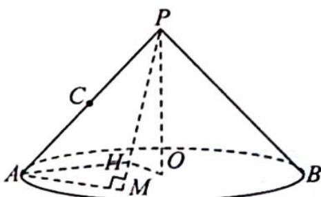
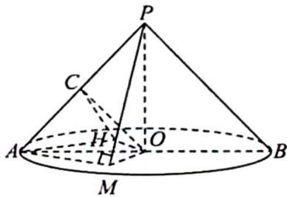

> [!faq]- 《高考数学培优40讲》例题解析
>
> > [!success]- **【答案】** D
>
> > [!note]- **【分析】**
> > 本题未单列分析。
>
> > [!note]- **【解析】**
> > 
> > 解析 因为 $\overrightarrow{MA} \cdot \overrightarrow{MP} = 0$ ，所以 $MA \perp MP$ ，空间内，点 M 的轨迹是以 PA 为直径的球面，又 $M \in \odot O$ ，圆锥的轴截面是以 P 为顶点的等腰直角三角形，所以 M 的轨迹是以 OA 为直径的圆，故 $AM \perp OM$ 。
> > 又 $PO \perp AM$ , 所以 $AM \perp$ 平面 $PMO$ , 则 $AM \perp OH$ , 又 $OH \perp PM$ , 所以 $OH \perp$ 平面 $PAM$ , 连接 $OC, HC, HA$ , 如图所示, 则 $OH \perp HC, OH \perp AH$ , 所以 $H$ 的轨迹是以 $OC$ 为直径的球和以 $OA$ 为直径的球的公共部分, 所以 $H$ 的轨迹是圆. 故选 D.
> > 
