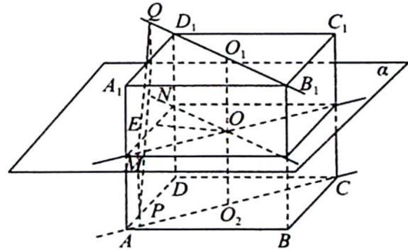
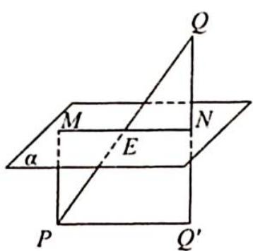
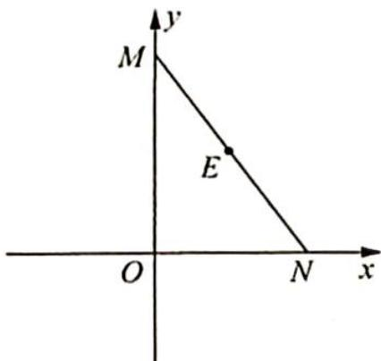

> [!faq]- 《高考数学培优40讲》例题解析
>
> > [!success]- **【答案】** D
>
> > [!note]- **【分析】**
> > 分析 ➤ 先作出平面 $\alpha$ ，设 P, Q 在平面 $\alpha$ 内的射影分别为 M, N，连接 OM, ON, MN，由正方体的性质可得出 $OM \perp ON, MN = 4\sqrt{3}$ ，建立平面直角坐标系可得出点 E 的轨迹.
>
> > [!note]- **【解析】**
> > 解析 如图1所示, $O_{1}, O_{2}$ 分别为 $B_{1}D_{1}, AC$ 的中点, 平面 $\alpha$ 平行于正方体 $ABCD-A_{1}B_{1}C_{1}D_{1}$ 的底面 $ABCD$ , 且平分正方体 $ABCD-A_{1}B_{1}C_{1}D_{1}$ , 则 $O_{1}O_{2}=4, O_{1}O_{2} \perp$ 平面 $\alpha, PQ$ 的中点 $E$ 必在平面 $\alpha$ 内.
> > 
> > 设 $O_{1}O_{2}\cap$ 平面 $\alpha = O,P,Q$ 在平面 $\alpha$ 内的射影分别为 $M,N,$ 连接 $OM,ON,MN,$ 则 $E$ 在 $MN$ 上且为 $MN$ 的中点，即 $ON / /$
> > 图1
> > $B_{1}D_{1},OM\parallel AC.$ 因为 $B_{1}D_{1}\perp AC$ , 所以 $ON\perp OM$ , 故 $\angle MON=90^{\circ}$ , 所以 MP=QN=2. 如图 2 所示, 设 Q 在平面 ABCD 的射影为 $Q'$ , 则 $MN=PQ'=\sqrt{PQ^{2}-QQ'^{2}}=\sqrt{8^{2}-4^{2}}=4\sqrt{3}.$
> > 以 O 为坐标原点, ON, OM 所在直线分别为 x 轴、y 轴建立平面直角坐标系, 如图 3 所示.
> > 设 $E(x, y)$ , 则 $OE = \frac{1}{2} MN = 2\sqrt{3}$ , 故点 E 的轨迹是以 O 为圆心, $2\sqrt{3}$ 为半径的圆, 其轨迹方程为 $x^{2} + y^{2} = 12$ , 故选 D.
> > 
> > 图2
> > 
> > 图3
> > 对于立体几何中的动点问题,常需“动中觅静”,这里的“静”是指问题中的不变量或者是不变关系,“动中觅静”就是在运动变化中探索问题中的不变性.
