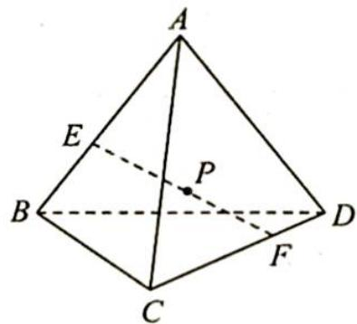
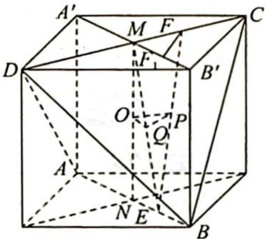

> [!faq]- 《高考数学培优40讲》例题解析
>
> > [!success]- **【答案】** 详见解析
>
> > [!note]- **【分析】**
> > 本题未单列分析。
>
> > [!note]- **【解析】**
> > 
> > 解析 ▶ 将正四面体 A-BCD 放到正方体里, 则正方体的边长为 $\sqrt{2}$ , 取 MN 中点为 O, EF 中点为 P, ME 中点为 Q, 则易证 $OQ \perp PQ$ , 如图所示, 设 $F_{1}$ 为 E 在平面 $A^{\prime}CB^{\prime}D$ 上的射影, 只有当 $FF_{1}=1$ 时, 才能保证 $EF=\sqrt{3}$ , 即 $MF^{2}+MF_{1}^{2}=1$ , $OQ^{2}+PQ^{2}=\left(\frac{1}{2}MF_{1}\right)^{2}+\left(\frac{1}{2}MF\right)^{2}=\frac{1}{4}(MF_{1}^{2}+MF^{2})=\frac{1}{4}$ , 而 $OQ^{2}+PQ^{2}=OP^{2}$ , 则 $OP^{2}=\frac{1}{4}$ , 故 P 点轨迹为圆, 周长为 $\pi$ ,
> > 
