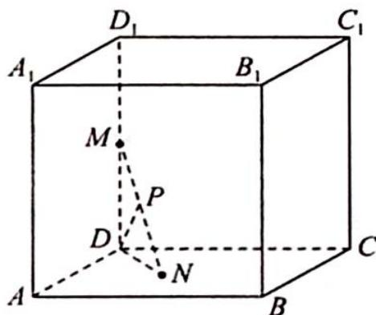
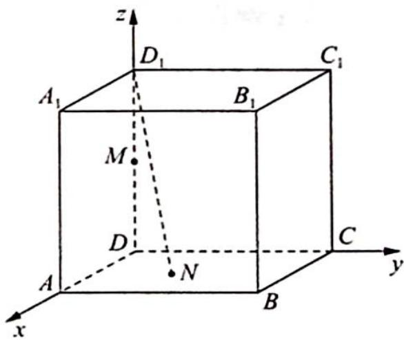

> [!faq]- 《高考数学培优40讲》例题解析
>
> > [!success]- **【答案】** BC
>
> > [!note]- **【分析】**
> > 分析 ▶ A 选项: 设 P 为斜边 MN 的中点, 连接 MN, ND, DP, 得到 Rt△MDN, 所以
> >
> > $PD = 1$ , 进而得到 $P$ 点的轨迹为圆, 即可判断选项 A 错误; B 选项: 可知 $NB \perp BB_{1}$ , 即 $NB$ 是点 $N$ 到直线 $BB_{1}$ 的距离, 在平面 $ABCD$ 中, 点 $N$ 到定点 $B$ 的距离与到定直线 $DC$ 的距离相等, 利用抛物线定义可知选项 B 正确; C 选项: 建立空间直角坐标系, 设 $N(x, y, 0)$ , 利用空间向量求夹角知 $\cos \frac{\pi}{3} = \frac{|\overrightarrow{D_1 N} \cdot \overrightarrow{AB}|}{|\overrightarrow{D_1 N}| |\overrightarrow{AB}|} = \frac{|2y|}{2\sqrt{x^2 + y^2 + 4}} = \frac{1}{2}$ , 化简可知 $N$ 的轨迹为双曲线, 选项 C 正确; D 选项: $MN$ 与平面 $ABCD$ 所成的角为 $\angle MND = \frac{\pi}{3}, ND = \frac{\sqrt{3}}{3}$ , 可知 $N$ 的轨迹是以 $D$ 为圆心, $\frac{\sqrt{3}}{3}$ 为半径的圆周, 选项 D 错误.
>
> > [!note]- **【解析】**
> > 解析 ▶ A 选项: 如图 1 所示, 连接 MN, ND, 设 P 为 MN 的中点, 连接 DP, 由正方体性质知 $\triangle MDN$ 为直角三角形, 且 P 为 MN 的中点, MN=2, 根据直角三角形斜边上的中线为斜边的一半, 可得 $\triangle MDN$ 始终有 MP=PD=1, 即 P 点的轨迹为圆, 且半径为 $\frac{\sqrt{3}}{2}$ , 其面积 $S=\pi\times\left(\frac{\sqrt{3}}{2}\right)^{2}=\frac{3\pi}{4}$ , 故 A 错误.
> > 
> > 图1
> > B 选项:由正方体性质知 $BB_{1} \perp$ 平面 $ABCD$ , 由线面垂直的性质定理知 $NB \perp BB_{1}$ , 即 $NB$ 是点 $N$ 到直线 $BB_{1}$ 的距离. 在平面 $ABCD$ 中, 点 $N$ 到定点 $B$ 的距离与到定直线 $DC$ 的距离相等, 所以点 $N$ 的轨迹是以点 $B$ 为焦点, 直线 $DC$ 为准线的抛物线, 故 $B$ 正确.
> > C 选项: 如图 2 所示, 以 D 为直角坐标系原点, 建立空间直角坐标系, 可得 $N(x, y, 0)$ , $D_{1}(0, 0, 2)$ , $A(2, 0, 0)$ , $B(2, 2, 0)$ , 则 $\overrightarrow{D_{1}N} = (x, y, -2)$ , $\overrightarrow{AB} = (0, 2, 0)$ , 利用空间向量求夹角知 $\cos \frac{\pi}{3} = \frac{|\overrightarrow{D_{1}N} \cdot \overrightarrow{AB}|}{|\overrightarrow{D_{1}N}| |\overrightarrow{AB}|} = \frac{|2y|}{2\sqrt{x^{2} + y^{2} + 4}} = \frac{1}{2}$ , 化简整理得 $3y^{2} - x^{2} = 4$ , 即 $\frac{y^{2}}{\frac{4}{3}} - \frac{x^{2}}{4} = 1$ , 所以 N 的轨迹为双曲线, 故 C 正确.
> > 
> > 图 2
> > D 选项:由正方体性质知 MN 与平面 ABCD 所成的角为 $\angle MND$ ，即 $\angle MND = \frac{\pi}{3}$ ，在 Rt△MDN 中， $ND = \frac{\sqrt{3}}{3}$ ，即 N 的轨迹是以 D 为圆心， $\frac{\sqrt{3}}{3}$ 为半径的圆周，故 D 错误.
> > 综上所述,
> >
> > 故选 **BC**.
