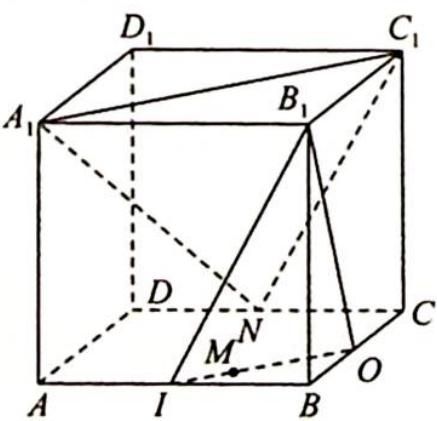
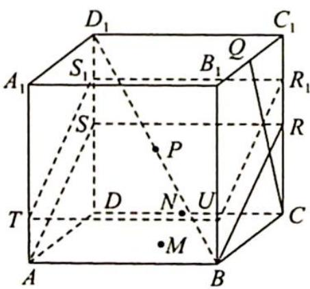

> [!faq]- 《高考数学培优40讲》例题解析
>
> > [!success]- **【答案】** D
>
> > [!note]- **【分析】**
> > 分析 ▶ ①: 结合圆锥的性质, 可判断其正确; ②: 结合抛物线的定义可知其正确; ③: 取 ${AB}$ 的中点 $I,{BC}$ 的中点 $O$ ,易证平面 ${B}_{1}{IO}//$ 平面 ${A}_{1}N{C}_{1}$ ,可知当 $M$ 在线段 ${IO}$ 上时,满足题意; ④: 只需过点 $P$ 作直线 ${CQ}$ 的垂面即可,垂面与正方体表面的交线即为动点 $M$ 的轨迹,求出周长,即可判断④正确.
>
> > [!note]- **【解析】**
> > 解析 ①: 因为满足条件的动点 M 是以 $DD_{1}$ 为轴线、以 $D_{1}A$ 为母线的圆锥与平面 ABCD 的交线，即圆的一部分，故①正确。
> > - **②**：依题意知点 M 到点 F 的距离与到直线 AB 的距离相等,所以 M 的轨迹是以 F 为焦点、AB 为准线的抛物线,故②正确.
> > - **③**：如图1所示,取AB的中点I,BC的中点O,显然 $IO//A_{1}C_{1},IB_{1}//NC_{1}$ ,从而可以证明平面 $B_{1}IO//$ 平面 $A_{1}NC_{1}$ ,当M在线段IO上时,均有 $B_{1}M//$ 平面 $A_{1}NC_{1}$ ,即动点M的轨迹是线段IO,故③正确.
> > - **④**：如图2所示,依题意可得只需过点P作直线CQ的垂面即可,垂面与正方体表面的交线即为动点M的轨迹.分别取 $CC_{1},DD_{1}$ 的中点R,S,由 $\tan\angle C_{1}QC=\tan\angle BRC=2$ 知 $\angle C_{1}QC=\angle BRC$ ,易知 $CQ\perp RB$ ,又 $CQ\perp AB,AB\cap BR=B$ ,所以 $CQ\perp$ 平面ABRS.过点P作平面ABRS的平行平面 $TUR_{1}S_{1}$ ,点M的轨迹为四边形 $TUR_{1}S_{1}$ ,其周长与四边形ABRS的周长相等,所以点M所构成的轨迹的周长为 $2\times4+2\times\sqrt{4^{2}+2^{2}}=8+4\sqrt{5}$ ,故④正确.
> > 因此说法正确的有 4 个, 故选 D.
> > 
> > 图 1
> > 
> > 图 2
