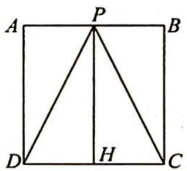
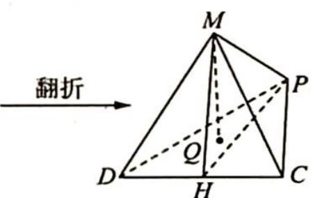
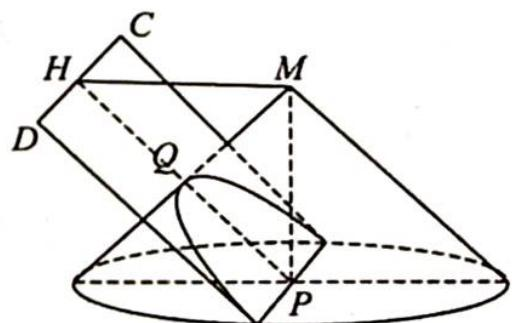

> [!faq]- 《高考数学培优40讲》例题解析
>
> > [!success]- **【答案】** D
>
> > [!note]- **【分析】**
> > 分析 ▶ 根据直线 $MQ$ 与棱 $MP$ 所成角为 $60^{\circ}$ , 可以将点 $M$ 看作圆锥的顶点, 点 $Q$ 在圆锥侧面上运动, 轨迹就是圆锥侧面与平面 $PCD$ 的交线.
>
> > [!note]- **【解析】**
> > 解析 如图 1、图 2 所示, 因为 $PA \perp AD$ , $PB \perp BC$ , 所以 $PM \perp MC$ , $PM \perp MD$ . 又 $MC \cap MD = M$ , 所以 $PM \perp$ 平面 $MDC$ . 又 $MQ$ 与 $MP$ 所成角为 $60^\circ$ , 故点 $Q$ 在以 $MP$ 为轴、母线与轴夹角为 $60^\circ$ 的圆锥侧面上.
> > 取 $DC$ 中点 $H$ , 连接 $PH, MH$ , 则 $PH = 2, MH = \sqrt{3}$ , 又 $PM = 1$ , 所以 $\angle MPH = 60^{\circ}$ , 即 $PM$ 与平面 $PDC$ 所成角为 $60^{\circ}$ .
> > 如图 3 所示, $\angle MPH$ 为 $PM$ 与平面 $PDC$ 所成的角, 又 $Q \in$ 平面 $PDC$ , 相当于用平行于母线的平面截圆锥, 则点 $Q$ 运动的轨迹为抛物线. 故选 D.
> > 
> > 图1
> > 
> > 图 2
> > 
> > 图 3
> > ## 评注
> > 圆锥曲线有多种定义,其中一个便是平面截圆锥所得的截面,随着截面倾斜角的变化,会产生不同的圆锥曲线:①截面与圆锥轴所成角为 $90^{\circ}$ ,截面为圆;
> > - **②**：截面与圆锥轴所成角大于轴线与母线夹角,截面为椭圆;
> > - **③**：截面与圆锥轴所成角等于圆锥轴线与母线夹角,即平面仅与一条母线平行,截面为抛物线;
> > - **④**：截面与圆锥轴所成角小于圆锥轴线与母线夹角,截面为双曲线.这便是圆锥曲线名字的由来.
