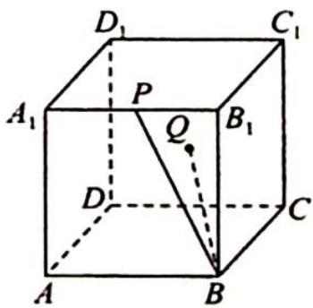
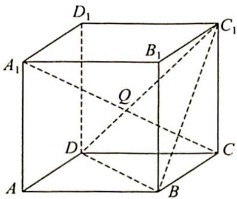
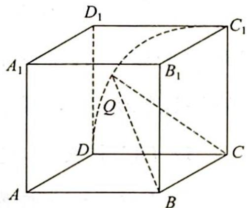

> [!faq]- 《高考数学培优40讲》例题解析
>
> > [!success]- **【答案】** AB
>
> > [!note]- **【分析】**
> > 本题未单列分析。
>
> > [!note]- **【解析】**
> > 
> > B. 若 $|BQ| = \sqrt{2}$ ，则动点 $Q$ 的轨迹是圆的一部分
> > C. 若 $\angle QBD_{1} = \angle PBD_{1}$ ，则动点 $Q$ 的轨迹是椭圆的一部分
> > D. 若点 $Q$ 到 $AB$ 与 $DD_{1}$ 的距离相等，则动点 $Q$ 的轨迹是抛物线的一部分
> > 解析 ▶ A 选项: 如图 1 所示, 因为 $A_{1}C \perp$ 平面 $BC_{1}D$ , 所以若 $BQ \perp A_{1}C$ , 则 $Q \in$ 平面 $BC_{1}D$ , 又 $Q \in$ 侧面 $DCC_{1}D_{1}$ , 所以点 $Q$ 轨迹是平面 $BC_{1}D$ 与侧面 $DCC_{1}D_{1}$ 的交线段 $DC_{1}$ , 故 A 正确.
> > 
> > B 选项: 若 $|BQ| = \sqrt{2}$ , 则 $Q$ 点在以 $B$ 为球心、 $\sqrt{2}$ 为半径的球面上, 又正方体棱长为 1 , 所以 $BC = 1 < \sqrt{2}$ , 即侧面 $DCC_{1}D_{1}$ 与球面 $B$ 的公共部分为圆弧 $\widehat{DC_{1}}$ , 如图 2 所示, 故 B 正确.
> > C 选项: 若 $\angle QBD_{1} = \angle PBD_{1}$ , 则点 $Q$ 在以 $BD_{1}$ 为轴、母线与轴夹角为 $\angle PBD_{1}$ 大小的圆锥侧面上. 连接 $BD_{1}, D_{1}P$ , 在 $\triangle BPD_{1}$ 中, 易知 $\cos \angle PBD_{1} = \frac{\sqrt{3}}{\sqrt{5}}$ . 连接 $CD_{1}$ , 在 $\triangle BCD_{1}$ 中, 易知 $\cos \angle BD_{1}C = \frac{\sqrt{2}}{\sqrt{3}} > \frac{\sqrt{3}}{\sqrt{5}}$ , 即截面与圆锥轴的夹角小于圆锥母线与轴的夹角, 故动点 $Q$ 的轨迹为双曲线. 故 C 错误.
> > 图1
> > 
> > 图 2
> > D 选项: 以 D 为原点、DC 为 x 轴、 $DD_{1}$ 为 y 轴建立坐标系, 则 $Q(x, y)$ 满足 $x^{2}=y^{2}+1$ , 故 $x^{2}-y^{2}=1$ , 所以 Q 点轨迹是双曲线的一部分, 故 D 错误.
> > 综上所述,
> >
> > 故选 **AB**.
