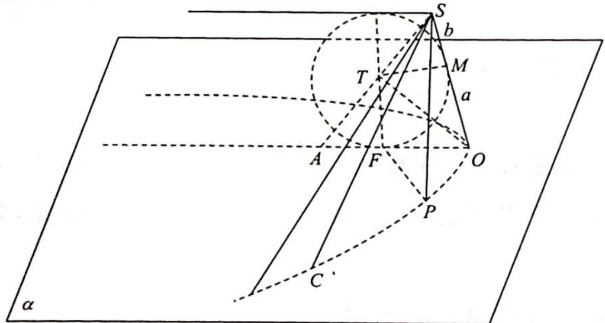
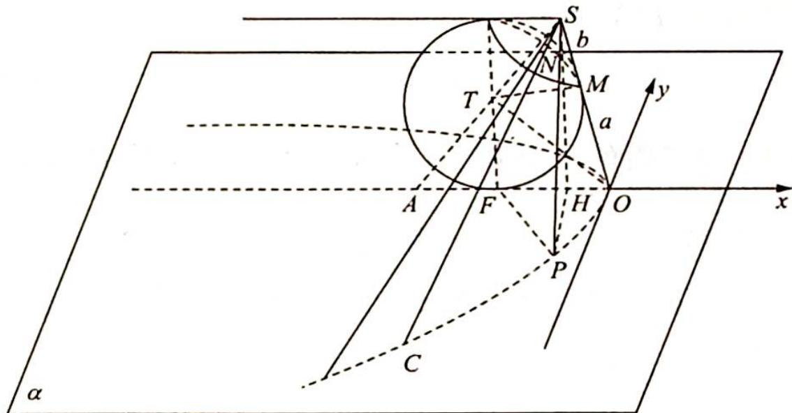

> [!faq]- 《高考数学培优40讲》例题解析
>
> > [!success]- **【答案】** 详见解析
>
> > [!note]- **【分析】**
> > 本题未单列分析。
>
> > [!note]- **【解析】**
> > 
> > 解析 (1) 因为球 $T$ 与平面 $\alpha$ 相切于点 $F$ , 所以 $TF \perp$ 平面 $\alpha$ .
> > 又 $ST \cap \alpha = A, AF \cap SO = O$ , 所以 $TF \subset$ 平面 $SOA$ , 则平面 $SOA \perp$ 平面 $\alpha$ .
> > 如图所示, 连接 $TO$ , 则 Rt $\triangle TFO \cong$ Rt $\triangle TMO$ , 所以 $|OF| = |OM| = a$ , 又 $\angle TAF = \angle TSM = \theta$ , 所以 $|AF| = |MS| = b, OT \perp SA$ .
> > 在 Rt△SOT 中， $|TM|^{2}=|MS||OM|=ab$ ，所以 $\tan\theta=\frac{TF}{AF}=\frac{TM}{AF}=\sqrt{\frac{a}{b}}$ .
> > (2)设另一条母线 $SP$ 与球 $T$ 的切点为 $N$ , 则 $|SN| = |SM| = b$ .
> > 如图所示,在平面 $\alpha$ 内建立平面直角坐标系 $xOy$ , 则 $F(-a,0), A(-a-b,0)$ .
> > 
> > 设点 $P$ 的坐标为 $(x, y)$ , 过 $S$ 作 $SH \perp \alpha$ , 垂足为 $H$ , 连接 $PH$ , 则 $|SH| = 2r = 2b\tan \theta = 2\sqrt{ab}$ , $|AH| = \frac{SH}{\tan\theta} = \frac{2\sqrt{ab}}{\sqrt{\frac{a}{b}}} = 2b$ , 所以 $|OH| = |a - b|$ , 则 $|PS|^2 = |PH|^2 + |SH|^2 = (x + a - b)^2 + y^2 + 4ab$ .
> > 又 $|PF|^2 = (x + a)^2 + y^2$ ，所以 $|PF| = |PN| = |PS| - b$ ，则 $\sqrt{(x + a - b)^2 + y^2 + 4ab} - b = \sqrt{(x + a)^2 + y^2}$ ，化简得 $y^2 = -4ax$ 。
> > 故在平面 $xOy$ 中, 曲线 $C$ 是以 $O$ 为顶点, $F$ 为焦点的抛物线. 证毕.
