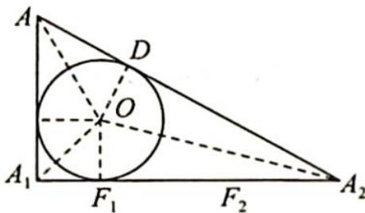

> [!faq]- 《高考数学培优40讲》例题解析
>
> > [!success]- **【答案】** A
>
> > [!note]- **【分析】**
> > 分析 ▶ 由题意知 $AA_{1} = 5$ , 设小球与 $A_{1}A_{2}$ 相切于点 $F_{1}, A_{2}F_{1} =$ 图2 $x$ , 从而可得 $A_{1}A_{2} = x + 2, AA_{2} = x + 3$ , 利用勾股定理可得 $x = 10$ , 再由离心率的定义即可求解.
>
> > [!note]- **【解析】**
> > 解析 ▶ 设小球 O 与点光源发出的射线相切于点 D，与底面相切于点 $F_{1}$ ，作出点光源光线所形成的圆锥与球的轴截面如图所示，在 Rt△AA₁A₂ 中，设 $A_{2}F_{1}=x$ ，则 $DA_{2}=x$ 。
> > 
> > 又 $AA_{1}=5, A_{1}A_{2}=x+2, AA_{2}=x+3$ ，所以 $5^{2}+(x+2)^{2}=(x+3)^{2}$ ，则 x=10，长轴长 $A_{1}A_{2}=2a=12, a=6$ ，由题意可知 $F_{1}$ 为椭圆的一个焦点，所以 c=6-2=4，即离心率 $e=\frac{c}{a}=\frac{2}{3}$ 。
> >
> > 故选 **A**.
