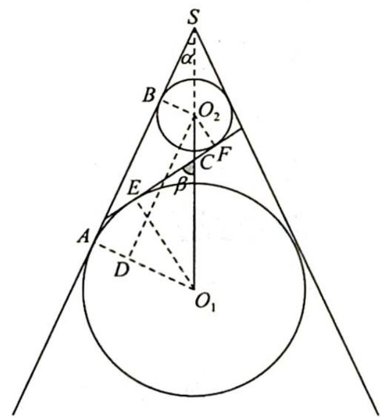

> [!faq]- 《高考数学培优40讲》例题解析
>
> > [!success]- **【答案】** 详见解析
>
> > [!note]- **【分析】**
> > 分析 利用已知条件和几何关系找出圆锥母线与轴的夹角为 $\alpha$ ，截面与轴的夹角为 $\beta$ 的余弦值，即可得出椭圆离心率。
>
> > [!note]- **【解析】**
> > 解析 如图所示, 圆锥面与其内切球 $O_{1}, O_{2}$ 分别相切于 $A, B$ , 连接 $O_{1} A, O_{2} B$ , 则 $O_{1} A \perp A B, O_{2} B \perp A B$ , 过 $O_{2}$ 作 $O_{2} D \perp O_{1} A$ 交 $O_{1} A$ 于 $D$ , 连接 $O_{1} E, O_{2} F, E F$ 交 $O_{1} O_{2}$ 于点 $C$ .
> > 设圆锥母线与轴的夹角为 $\alpha$ ，截面与轴的夹角为 $\beta$ .
> > 在 Rt△O₂DO₁ 中，DO₁=3-1=2，O₂D=√8²-2²=2√15，
> > 所以 $\cos\alpha=\frac{O_{2}D}{O_{1}O_{2}}=\frac{2\sqrt{15}}{8}=\frac{\sqrt{15}}{4}$
> > 
> > $$
> > O _ {1} O _ {2} = 8
> > $$
> > $$
> > C O _ {1} = 8 - O _ {2} C
> > $$
> > $$
> > \triangle E O _ {1} C \sim \triangle F O _ {2} C
> > $$
> > 以 $\frac{8 - O_2C}{O_1E} = \frac{O_2C}{O_2F}$ 解得 $O_{2}C = 2$ ，则 $CF = \sqrt{O_2C^2 - FO_2^2} = \sqrt{2^2 - 1^2} = \sqrt{3}$ 即 $\cos \beta = \frac{CF}{O_2C} = \frac{\sqrt{3}}{2}$ 故椭圆的离心率 $e = \frac{\cos\beta}{\cos\alpha} = \frac{\frac{\sqrt{3}}{2}}{\frac{\sqrt{15}}{4}} = \frac{2\sqrt{5}}{5}$
> > ## 评注
> > “Dandelin 双球模型”椭圆离心率等于截面与轴的夹角的余弦 $\cos\beta$ 与圆锥母线与轴的夹角的余弦 $\cos\alpha$ 之比，即 $e=\frac{\cos\beta}{\cos\alpha}$ . 证明如下：因为 $\cos\alpha=\frac{O_{2}D}{O_{1}O_{2}}$ , $\cos\beta=\frac{CF}{O_{2}C}=\frac{CE}{O_{1}C}=\frac{EF}{O_{1}O_{2}}$ , 所以 $e=\frac{c}{a}=\frac{2c}{2a}=\frac{EF}{AB}=\frac{EF}{O_{2}D}=\frac{\cos\beta}{\cos\alpha}$ .
