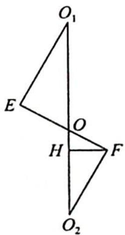

> [!faq]- 《高考数学培优40讲》例题解析
>
> > [!success]- **【答案】** 详见解析
>
> > [!note]- **【分析】**
> > 分析 ▶ (1)设圆柱底面半径为 R, 则圆的半径为 R, 由题意可知 $O_{1}, E$ , F, $O_{2}$ 四点共面, $O_{1}E \perp EF$ , $O_{2}F \perp EF$ , $O_{1}E = O_{2}F = R$ , 连接 $O_{1}O_{2}$ , 过点 F 作 FH $\perp O_{1}O_{2}$ , AB = $O_{1}O_{2} = 4$ , 由直角三角形的边角关系可求出半径 R.
> >
> > (2)椭圆的短半轴 $R = \sqrt{3}$ , 长轴长 $2a = \frac{2R}{\cos 30^\circ} = 4$ , 即可求出结果.
>
> > [!note]- **【解析】**
> > 解析 (1)设圆柱底面半径为 $R$ , 则圆的半径为 $R$ , 由题意可知 $O_{1}, E, F$ , $O_{2}$ 四点共面, 由圆柱和球的性质可知 $AB = O_{1}O_{2} = 4$ , 连接 $O_{1}O_{2}$ , 过点 $F$ 作 $FH \perp O_{1}O_{2}$ , 如图所示, $\angle OFH = 30^{\circ}, \angle FOH = 60^{\circ}$ .
> > 因为椭圆与两球相切, 所以 $O_{1}E \perp EF$ , $O_{2}F \perp EF$ , $O_{1}E = O_{2}F = R$ , 则 $O_{1}O_{2} = O_{1}O + O_{2}O = \frac{O_{1}E}{\sin\angle O_{1}OE} + \frac{O_{2}F}{\sin\angle O_{2}OF} = \frac{2R}{\frac{\sqrt{3}}{2}} = \frac{4R}{\sqrt{3}} = 4$ , 即 $R = \sqrt{3}$ .
> > 
> > (2)由题意知椭圆的短半轴长 $R = \sqrt{3}$ , 长轴长 $2a = \frac{2R}{\cos 30^\circ} = \frac{4R}{\sqrt{3}} = 4, c = \sqrt{a^2 - b^2} = \sqrt{4 - 3} = 1$ , 则 $e = \frac{c}{a} = \frac{1}{2}$ .
