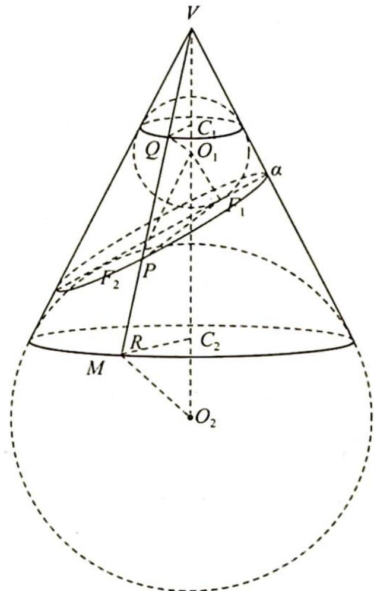

> [!faq]- 《高考数学培优40讲》例题解析
>
> > [!success]- **【答案】** A
>
> > [!note]- **【分析】**
> > 分析 ▶ 在椭圆上任取一点 P，连接 VP 交球 $O_{1}$ 于点 Q，交球 $O_{2}$ 于点 R，可证明 $\triangle O_{1}PF_{1} \cong \triangle O_{1}PQ$ ，可得 $PF_{1} = PQ$ ，设点 P 沿圆锥表面到达 M 的路线长为 $d_{PM}$ ，则 $PF_{1} + d_{PM}$
> >
> > $= PQ + d_{PM} \geqslant PQ + PR = QR$ ，当且仅当 $P$ 为直线 $VM$ 与椭圆交点时取等号， $QR = VR - VQ$ 即可求解。
>
> > [!note]- **【解析】**
> > 解析 如图所示, 在椭圆上任取一点 $P$ , 连接 $VP$ 交球 $O_{1}$ 于点 $Q$ , 交球 $O_{2}$ 于点 $R$ , 连接 $O_{1} Q, O_{1} F_{1}, P O_{1}, P F_{1}, O_{2} R, C_{1} Q, C_{2} R, r_{1}, r_{2}$ 分别为 $\odot C_{1}, \odot C_{2}$ 的半径.
> > 在 $\triangle O_{1}PF_{1}$ 与 $\triangle O_{1}PQ$ 中有 $O_{1}Q=O_{1}F_{1},\angle O_{1}QP=\angle O_{1}F_{1}P=90^{\circ},O_{1}P$ 为公共边,所以 $\triangle O_{1}PF_{1}\cong\triangle O_{1}PQ$ ,则 $PF_{1}=PQ$ .
> > 
> > 设点 P 沿圆锥表面到达 M 的路线长为 $d_{PM}$ ，则 $PF_{1} + d_{PM} = PQ + d_{PM} \geqslant PQ + PR = QR$ ，当且仅当 P 为直线 VM 与椭圆交点时取等号，QR = VR - VQ = $\frac{r_{2} - r_{1}}{\sin 30^{\circ}} = 6$ ，所以最小值为 6。
> >
> > 故选 **A**。
