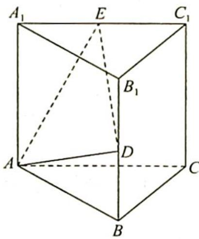

<!-- question-source:start -->
1. 如图所示, 在直三棱柱 $ABC - A_{1}B_{1}C_{1}$ 中, $AA_{1} = AB = BC = 2, D, E$ 分别为 $BB_{1}, A_{1}C_{1}$ 的中点, 则过点 $A, D, E$ 的截面与三棱柱的侧面 $BCC_{1}B_{1}$ 的交线的长为 \_\_\_\_.

<!-- question-source:end -->

![[Q00020055A1]]
