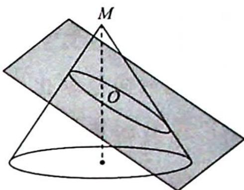

<!-- question-source:start -->
7. 如图所示, 在圆锥中, 母线与旋转轴夹角为 $30^{\circ}$ , 现有一截面与圆锥的一条母线垂直, 与旋转轴的交点 $O$ 到圆锥顶点 $M$ 的距离为 1 , 对于所得截口曲线给出如下命题: ① 曲线形状为椭圆. ② 点 $O$ 为该曲线上任意两点最长距离的三等分点. ③ 该曲线上任意两点间的最长距离为 $\frac{3}{2}$ , 最短距离为 $\frac{2}{3} \sqrt{3}$ . ④ 该曲线的离心率为 $\frac{\sqrt{3}}{3}$ . 其中正确命题的序号为 ( ). A. ①②④ B. ①②③④ C. ①②③ D. ①④

<!-- question-source:end -->

![[Q00020061A1]]
