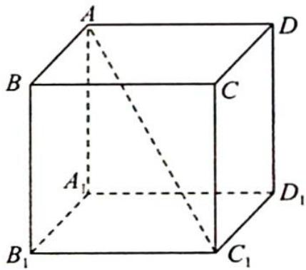

<!-- question-source:start -->
8.(2022人大附中高三三模试卷10)如图所示,已知棱长为1的正方体 $ABCD-A_{1}B_{1}C_{1}D_{1},O$ 为对角线 $AC_{1}$ 上一点(不与点A, $C_{1}$ 重合),过点O作垂直于直线 $AC_{1}$ 的平面 $\alpha$ ,平面 $\alpha$ 与正方体表面相交形成的多边形记为M,下列结论不正确的是( ). A.M只可能为三角形或六边形 B.平面ABCD与平面 $\alpha$ 的夹角为定值 C.当且仅当O为对角线 $AC_{1}$ 中点时,M的周长最大 D.当且仅当O为对角线 $AC_{1}$ 中点时,M的面积最大

<!-- question-source:end -->

![[Q00020062A1]]
