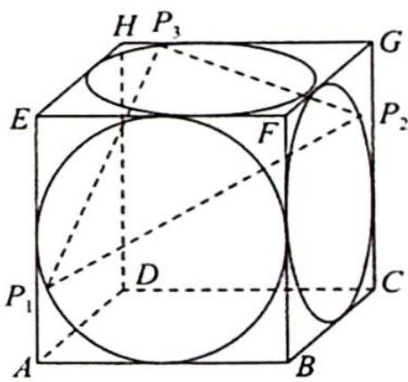

<!-- question-source:start -->
9. 如图所示, 正方体 $ABCD-EFGH$ 的棱长为 2 , 在正方形 $ABFE$ 的内切圆上任取一点 $P_{1}$ , 在正方形 $BCGF$ 的内切圆上任取一点 $P_{2}$ , 在正方形 $EFGH$ 的内切圆上任取一点 $P_{3}$ . 求 $\left| P_{1} P_{2} \right| + \left| P_{2} P_{3} \right| + \left| P_{3} P_{1} \right|$ 的最小值与最大值.

<!-- question-source:end -->

![[Q00020063A1]]
