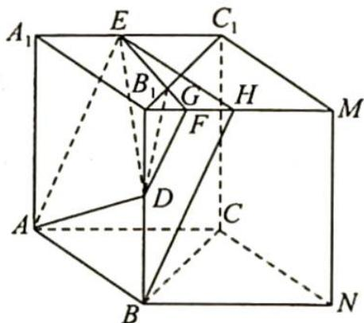

> [!faq]- 《高考数学培优40讲》参考答案
>
> > [!success]- **【答案】** 详见解析
>
> > [!note]- **【分析】**
> > 本题未单列分析。
>
> > [!note]- **【解析】**
> > 由题意将直三棱柱 $ABC-A_{1}B_{1}C_{1}$ 补成一个直四棱柱 $ABNC-A_{1}B_{1}MC_{1}$ ，如图所示，取 $B_{1}M$ 中点 H，
> > 连接 BH, 显然 $BH \parallel AE$ ; 取 $B_{1}H$ 中点 F, 连接 DF, 则 $DF \parallel BH \parallel AE$ , 所以 A, D, F, E 四点共平面.
> > 连接 EF 与 $B_{1}C_{1}$ 的交点为 G，连接 DG，所以过点 A, D, F, E 的截面与三棱柱的侧面 $BCC_{1}B_{1}$ 的交线为 DG，因为 $\triangle B_{1}FG \sim \triangle C_{1}EG$ ，且 $B_{1}F = \frac{1}{2}EC_{1}$ ，所以点 G 为线段 $B_{1}C_{1}$ 的靠近 $B_{1}$ 的三等分点，因为 $B_{1}C_{1} = 2$ ，所以 $B_{1}G = \frac{2}{3}$ ，又 D 为 $BB_{1}$
> > 
> > 中点，所以 $DB_{1} = 1$ ，因为 $BB_{1}\bot$ 平面 $A_{1}B_{1}C_{1}$ ，所以 $BB_{1}\bot B_{1}C_{1}$ ，则 $DG = \sqrt{1 + \left(\frac{2}{3}\right)^2} = \frac{\sqrt{13}}{3}$
