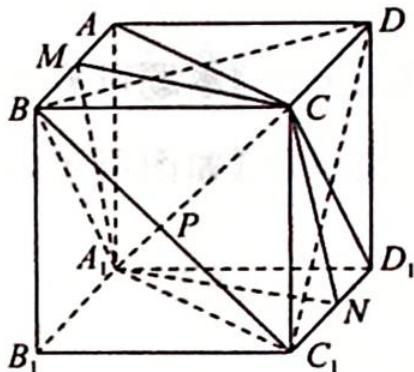

> [!faq]- 《高考数学培优40讲》参考答案
>
> > [!success]- **【答案】** C
>
> > [!note]- **【分析】**
> > 本题未单列分析。
>
> > [!note]- **【解析】**
> > 【分析】本题涉及动点 P 对应的截面变化,可以从特殊位置入手,再推广到一般情况.
> > 【解析】由 $P \in BC_{1}$ 得 $PD \subset$ 平面 $BC_{1}D$ ，易知 $A_{1}C \perp$ 平面 $BC_{1}D$ ，故 $A_{1}C \subset$ 平面 $\alpha$ .
> > 找两个特例, ①当 $P$ 与 $B$ 重合, $AC \perp BD$ , 则平面 $\alpha$ 即为平面 $ACC_{1}A_{1}$ ;
> > - **②**：当 $P$ 与 $C_{1}$ 重合, $CD_{1} \perp C_{1}D$ , 则平
> > 面 $\alpha$ 即为平面 $BCD_{1}A_{1}$ ; 此时, $\alpha$ 的面积为 $\sqrt{2}$ .
> > 再选一特例:③如图所示,当 P 为 $BC_{1}$ 的中点,取 $AB, C_{1}D_{1}$ 的中点为 M, N, 则 $PD \perp$ 平面 $A_{1}MCN$ , 此时,平面 $\alpha$ 即为平面 $A_{1}MCN$ , 易知 $\alpha$ 的面积为 $\frac{\sqrt{6}}{2}$ .
> > 结合选项及图形变化, 易知点 $P$ 从 $B$ 到 $C_{1}$ 移动的过程, 截面 $\alpha$ 是从矩形 $ACC_{1}A_{1}$ 到平行四边形 $A_{1}MCN$ , 再到矩形 $BCD_{1}A_{1}$ 的变化过程, 由对称性易知截面 $\alpha$ 面积最小值为 $\frac{\sqrt{6}}{2}$ . 故选 C.
> > 
> > 【评注】由分析知截面 $\alpha$ 是平行四边形 $A_{1}MCN$ ，且 $M \in AB, N \in C_{1}D_{1}$ ，则平行四边
> > 形 $A_{1}MCN$ 即为所求. 所以截面 $\alpha$ 的面积 $S = S_{\triangle MA_1C} + S_{\triangle NA_1C}$ . 设 $M$ 到 $A_{1}C$ 的距离为 $d$ , 则 $S = 2 \times \frac{1}{2} \times |A_{1}C| \cdot d = \sqrt{3} d$ . 当 $P$ 在 $BC_{1}$ 上移动, $M$ 在 $AB$ 上移动, 故 $d$ 的最小值即为异面直线 $A_{1}C$ 与 $AB$ 间的距离, 所以 $d_{\min} = \frac{\sqrt{2}}{2}$ , 则 $S = \frac{\sqrt{6}}{2}$ .
> >
> > 故选 **C**.
