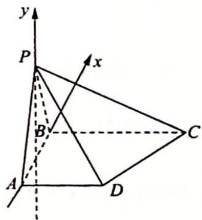

> [!faq]- 《高考数学培优40讲》参考答案
>
> > [!success]- **【答案】** B
>
> > [!note]- **【分析】**
> > 本题未单列分析。
>
> > [!note]- **【解析】**
> > 因为 $AD \perp$ 平面 PAB, $AD \subset$ 平面 ABCD, 所以平面 $PAB \perp$ 平面 ABCD, 故动点 P 在过 AB 且与平面 ABCD 垂直的平面内.
> > 因为 $AD \perp$ 平面 PAB, BC ⊥ 平面 PAB, 所以 $AD \parallel BC$ , 且 $\angle CBP = \angle DAP = 90^{\circ}$ , 又 $\angle APD = \angle CPB$ , 故 $\triangle CBP \sim \triangle DAP$ , 则 $\frac{PA}{PB} = \frac{AD}{BC} = \frac{1}{2}$ .
> > 在平面 PAB 内, 以 AB 所在直线为 x 轴, AB 的中点为坐标原点, 建立如图所示的直角坐标系, 则 A(-3,0), B(3,0).
> > 
> > 设 $P(x, y)$ , 则 $\frac{\sqrt{(x + 3)^2 + y^2}}{\sqrt{(x - 3)^2 + y^2}} = \frac{1}{2}$ , 化简得 $x^2 + y^2 + 10x + 9 = 0$ , 注意到点 $P$ 不在直线 $AB$ 上, 因为点 $P$ 的轨迹方程为 $x^2 + y^2 + 10x + 9 = 0 (y \neq 0)$ , 所以点的轨迹为一个不完整的圆, 故选 B.
> > 【评注】本题为选择题,当得到 $\frac{PA}{PB} = \frac{1}{2}$ 以后就可以根据“阿波罗尼斯圆”定义得到轨迹为圆的一部分.
