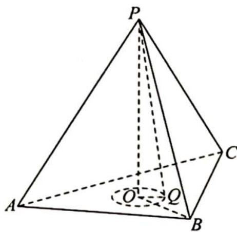

> [!faq]- 《高考数学培优40讲》参考答案
>
> > [!success]- **【答案】** B
>
> > [!note]- **【分析】**
> > 本题未单列分析。
>
> > [!note]- **【解析】**
> > 【分析】本题可看作以 P 为球心,5 为半径的球与底面 ABC 的截面面积的求解.
> > 【解析】如图所示, 设顶点 $P$ 在底面上的投影为 $O$ , 连接 $BO$ , 则 $O$ 为三角形 $ABC$ 的中心, 且 $BO = \frac{2}{3} \times 6 \times \frac{\sqrt{3}}{2} = 2\sqrt{3}$ , 故 $PO = \sqrt{36 - 12} = 2\sqrt{6}$ . 因为 $PQ = 5$ , 故 $OQ = 1$ , 而 $\triangle ABC$ 内切圆的圆心为 $O$ , 半径为 $\sqrt{3} > 1$ , 所以 $T$ 表示的区域为以 $O$ 为圆心, 1 为半径的圆及其内部, 则其面积为 $\pi$ . 故选 B.
> > 
