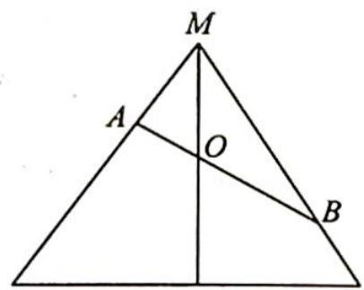
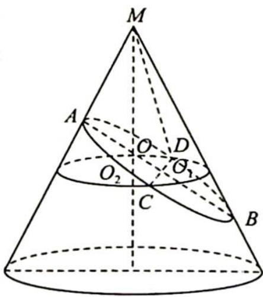

> [!faq]- 《高考数学培优40讲》参考答案
>
> > [!success]- **【答案】** A
>
> > [!note]- **【分析】**
> > 本题未单列分析。
>
> > [!note]- **【解析】**
> > 【分析】画出轴截面的图像. 根据选项可判断出①正确; 解直角三角形计算出 AO 的
> > 长以及长轴 $AB$ 的长, 由此可判断出②正确, 排除 D 选项; 由于曲线是连续不断的, 故任意两点间没有最短距离, 故③错误, 排除 B, C 选项; 由此得出正确结论.
> > 【解析】根据截面性质可知①正确,即曲线形状为椭圆.
> > 画出轴截面的图像如图1所示,由于 $\angle AMO=\angle BMO=30^{\circ},MA\perp AB,MO=1$ ,所以 $AO=\frac{1}{2}MO=\frac{1}{2},\angle OMB=\angle OBM=30^{\circ}$ ,即 $BO=MO=1$ ,所以 $\frac{AO}{BO}=\frac{1}{2}$ ,而曲线上任意两点之间的最长距离为 $AB$ ,故点 $O$ 为该曲线上任意两点之间最长距离的三等分点,由此可判断出②正确,排除D选项.
> > 
> > 图1
> > 由于曲线是连续不断的,故任意两点间没有最短距离,③错误,排除 B,C 选项.
> > 由②可知 $AB = \frac{1}{2} + 1 = \frac{3}{2}$ , 如图2所示, 设 $AB$ 中点为 $O_{1}, AO_{1} = \frac{3}{4}, OO_{1} = \frac{3}{4} - \frac{1}{2} = \frac{1}{4}$ .
> > 在椭圆平面上, 过 $O_{1}$ 作 $CD \perp AB$ 交圆锥的母线于点 $C, D$ , 过 $O_{1}, C, D$ 作垂直于 $MO$ 的平面交 $MO$ 于点 $O_{2}, O_{1}O_{2} = OO_{1}\cos 30^{\circ} = \frac{\sqrt{3}}{8}, OO_{2} = OO_{1}\sin 30^{\circ} = \frac{1}{8}, O_{2}C = MO_{2} \cdot \tan 30^{\circ} = (MO + OO_{2})\tan 30^{\circ} = \left(1 + \frac{1}{8}\right) \cdot \frac{\sqrt{3}}{3} = \frac{3\sqrt{3}}{8}$ .
> > 
> > 由勾股定理得 $O_{1}C = \sqrt{O_{2}C^{2} - O_{1}O_{2}^{2}} = \sqrt{\left(\frac{3\sqrt{3}}{8}\right)^{2} - \left(\frac{\sqrt{3}}{8}\right)^{2}} = \frac{\sqrt{6}}{4}\cdot CD = 2O_{1}C = \frac{\sqrt{6}}{2},$
> > 所以在椭圆中， $2a = AB = \frac{3}{2}, 2b = CD = \frac{\sqrt{6}}{2}$ ，则 $a = \frac{3}{4}, b = \frac{\sqrt{6}}{4}$ .
> > 图 2
> > 所以离心率 $e = \frac{c}{a} = \frac{\sqrt{a^2 - b^2}}{a} = \frac{\sqrt{3}}{3}$ , 故④正确. 故选 A.
> > 【评注】“Dandelin 双球模型”椭圆离心率等于截面与轴的夹角的余弦 $\cos\beta$ 与圆锥母线与轴的夹角的余弦 $\cos\alpha$ 之比, 即 $e=\frac{\cos\beta}{\cos\alpha}=\frac{\sqrt{3}}{3}$ .
