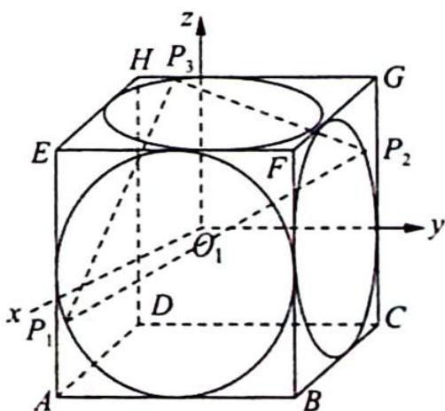
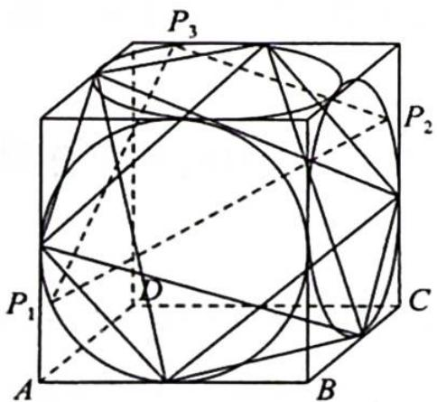
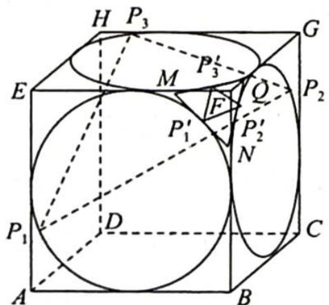
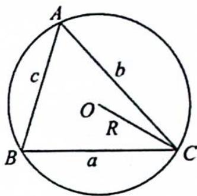

> [!faq]- 《高考数学培优40讲》参考答案
>
> > [!success]- **【答案】** 【分析】思路一(向量法): 建立空间直角坐标系, 用三角函数表示点的坐标, 转化为三角函数的最值问题. 思路二(几何法): 把 $\triangle P_{1}P_{2}P_{3}$ 看作该正方体的棱切球的某截面圆的内接三角形, 而圆的内接三角形周长最大值在其为等边三角形时取得.
>
> > [!note]- **【分析】**
> > 本题未单列分析。
>
> > [!note]- **【解析】**
> > 解法一(向量法):以正方体的中心 $O_{1}$ 为原点, $\overrightarrow{DA}, \overrightarrow{DC}, \overrightarrow{DH}$ 的方向分别为 x 轴、y 轴、z 轴的正方向, 建立空间直角坐标系 $O_{1}-xyz$ .
> > 根据条件, 可设 $P_{1}(1, \cos \alpha_{1}, \sin \alpha_{1}), P_{2}(\sin \alpha_{2}, 1, \cos \alpha_{2}), P_{3}(\cos \alpha_{3}, \sin \alpha_{3}, 1)$ , 约定 $P_{4} = P_{1}, \alpha_{4} = \alpha_{1}$ , 记 $d_{i} = |P_{i}P_{i+1}| (i = 1, 2, 3)$ , 则 $d_{i}^{2} = (1 - \sin \alpha_{i+1})^{2} + (1 - \cos \alpha_{i})^{2} + (\sin \alpha_{i} - \cos \alpha_{i+1})^{2}$ ①. 记 $f = |P_{1}P_{2}| + |P_{2}P_{3}| + |P_{3}P_{1}|$ .
> > 
> > 先求 f 的最小值: 对 i = 1, 2, 3, 根据式①与平均值不等式得 $d_{i}^{2} \geqslant (1 - \sin \alpha_{i+1})^{2} +$
> > $(1 - \cos \alpha_{i})^{2} \geqslant \frac{1}{2} ((1 - \sin \alpha_{i+1}) + (1 - \cos \alpha_{i}))^{2}$ , 故 $d_{i} \geqslant \frac{\sqrt{2}}{2} (2 - \sin \alpha_{i+1} - \cos \alpha_{i})$ . 于是 $f = d_{1} + d_{2} + d_{3} \geqslant \frac{\sqrt{2}}{2} \sum_{i=1}^{3} (2 - \sin \alpha_{i+1} - \cos \alpha_{i}) = 3\sqrt{2} - \frac{\sqrt{2}}{2} \sum_{i=1}^{3} (\sin \alpha_{i} + \cos \alpha_{i}) = 3\sqrt{2} - \sum_{i=1}^{3} \sin (\alpha_{i} + \frac{\pi}{4}) \geqslant 3\sqrt{2} - 3$ .
> > 当 $\alpha_{i} = \frac{\pi}{4} (i = 1,2,3)$ 时， $f$ 可取到最小值 $3\sqrt{2} - 3$ .
> > 再求 $f$ 的最大值: 由式①知 $d_{i}^{2} = 4 - 2\cos \alpha_{i} - 2\sin \alpha_{i + 1} - 2\sin \alpha_{i}\cos \alpha_{i + 1}$ , 注意到 $\sin \alpha_{i} \geqslant -1, \cos \alpha_{i} \geqslant -1 (i = 1, 2,3)$ , 有
> > $$
> > \begin{array}{r l} \sum_ {i = 1} ^ {3} d _ {i} ^ {2} & = 1 2 - 2 \left(\sum_ {i = 1} ^ {3} \sin \alpha_ {i + 1} + \sum_ {i = 1} ^ {3} \cos \alpha_ {i} + \sum_ {i = 1} ^ {3} \sin \alpha_ {i} \cos \alpha_ {i + 1}\right) \\ & = 1 2 - 2 \left(\sum_ {i = 1} ^ {3} \sin \alpha_ {i} + \sum_ {i = 1} ^ {3} \cos \alpha_ {i + 1} + \sum_ {i = 1} ^ {3} \sin \alpha_ {i} \cos \alpha_ {i + 1}\right) \\ & = 1 8 - 2 \sum_ {i = 1} ^ {3} (1 + \sin \alpha_ {i}) (1 + \cos \alpha_ {i + 1}) \leqslant 1 8. \end{array}
> > $$
> > 由柯西不等式知 $f^2 \leqslant 3(d_1^2 + d_2^2 + d_3^2) = 54$ ，故 $f \leqslant 3\sqrt{6}$ ，当 $\alpha_i = \frac{3\pi}{2}$ 或者 $\alpha_i = \pi (i = 1, 2, 3)$ 时， $f$ 可取到最大值 $3\sqrt{6}$ 。综上所述， $f$ 的最小值为 $3\sqrt{2} - 3$ ，最大值为 $3\sqrt{6}$ 。
> > 解法二(几何法):由题意可知, $P_{1},P_{2},P_{3}$ 三点所在圆恰好是正方体三个侧面与其棱切球的球面形成的截面圆,故 $\left|P_{1}P_{2}\right|+\left|P_{2}P_{3}\right|+\left|P_{3}P_{1}\right|$ 可看作是正方体的棱切球的球面上三点的距离和.(需满足一定条件)又因为不共线三点确定一个平面,所以 $\triangle P_{1}P_{2}P_{3}$ 可看作该正方体某截面圆的内接三角形.
> > - **①**：由“圆的内接三角形为等边三角形时周长最大”知， $|P_{1}P_{2}| + |P_{2}P_{3}| + |P_{3}P_{1}|$ 的最大值为 $2R\sin \frac{\pi}{3}\cdot$ $3 = 3\sqrt{3} R = 3\sqrt{3}\times \frac{\sqrt{2}}{2} a = 3\sqrt{6}$ （ $R$ 为正方体棱切球半径， $a$ 为正方体棱长）.
> > - **②**：由球体的性质得 $R^2 = r^2 + d^2$ ( $R$ 为球的半径, $r$ 为截面小圆的半径, $d$ 为球心到截面圆的距离)再结合图形知, 当截面垂直体对角线 $DF$ 时, 有最小半径的截面圆, 由动态变化可得当截面 $\alpha //$ 平面 $EGB$ , 且与正方体三条侧棱交点分别为 $M, N, Q$ 时, 如图所示, $MN$ 与圆相切于 $P_1'$ , $NQ$ 与圆相切于 $P_2'$ , $MQ$ 与圆相切于 $P_3'$ , 此时 $|P_1' P_2'| = |P_2' P_3'| = |P_3' P_1'| = \sqrt{2} - 1$ , 恰好也是 $|P_1 P_2| + |P_2 P_3| + |P_3 P_1|$ 的最小值 $3\sqrt{2} - 3$ . 综上所述, $|P_1 P_2| + |P_2 P_3| + |P_3 P_1|$ 的最大值为 $3\sqrt{6}$ , 最小值为 $3\sqrt{2} - 3$ .
> > 
> > 
> > 【评注】1. 解法一注意以下几点: ①点 $P_{2}$ 的坐标;
> > - **②**：$P_{4} = P_{1}$ ;
> > - **③**：三角函数有界性放缩;
> > - **④**：均值不等式放缩;
> > - **⑤**：柯西不等式放缩.
> > 2. 用几何法求解此题时, 求最大值是没有问题的, 但在求最小值时有个问题: 因为圆虽是最小的截面圆, 但此最小圆的内接三角形, 周长是最大的三角形. 因此在求最小值时是不严谨的, 但此方法仍不失为一个简洁的求解途径.
> > ## 圆的内接三角形周长何时最大
> > 证明圆的内接三角形周长最大值在其为等边三角形时取得.
> > 证明:如图所示,设 $\triangle ABC$ 的外接圆圆心为O,半径为R,内角A,B,C所对边分别为a,b,c.
> > 周长 $L = a + b + c = 2R(\sin A + \sin B + \sin C) \leqslant 2R \cdot 3\sin \frac{A + B + C}{3} = 2R \cdot \frac{3\sqrt{3}}{2} = 3\sqrt{3} R.$
> > 
> > 当且仅当 $A = B = C = \frac{\pi}{3}$ 时取等号.（此为琴生不等式，用到函数凹凸性）
> > 另证: 在 $\triangle ABC$ 中, $A+B+C=\pi$ .
> > $$
> > \begin{array}{r l} {\sin A + \sin B + \sin C} & {= 2 \sin \frac {A + B}{2} \cos \frac {A - B}{2} + 2 \sin \frac {A + B}{2} \cos \frac {A + B}{2}} \\ & {\leqslant 2 \sin \frac {A + B}{2} \left(1 + \cos \frac {A + B}{2}\right) (\cos \frac {A - B}{2} \leqslant 1, \text {有界性放缩})} \\ & {= 2 \cos \frac {C}{2} \left(1 + \sin \frac {C}{2}\right)} \\ & {= 2 \sqrt {1 - \sin^ {2} \frac {C}{2}} \left(1 + \sin \frac {C}{2}\right)} \\ & {= 2 \sqrt {\left(1 - \sin \frac {C}{2}\right) \left(1 + \sin \frac {C}{2}\right) ^ {3}}} \\ & {= 2 \sqrt {2 7 \left(1 - \sin \frac {C}{2}\right) \left(\frac {1 + \sin \frac {C}{2}}{3}\right) ^ {3}} (\text {四维均值不等式，可求导})} \\ & {\leqslant 6 \sqrt {3} \sqrt {\left[ \frac {1 - \sin \frac {C}{2} + 1 + \sin \frac {C}{2}}{4} \right] ^ {4}}} \\ & {= 6 \sqrt {3} \cdot \sqrt {\left(\frac {2}{4}\right) ^ {4}} = 6 \sqrt {3} \times \frac {1}{4} = \frac {3 \sqrt {3}}{2}.} \end{array}
> > $$
> > 当且仅当 $\left\{\begin{aligned}\cos\frac{A-B}{2}&=1\\ 1-\sin\frac{C}{2}&=\frac{1+\sin\frac{C}{2}}{3}\end{aligned}\right.$ ，即 $A=B=C=\frac{\pi}{3}$ 时取等号.
> > 故圆的内接三角形周长最大时,三角形为等边三角形.
