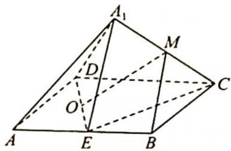

## 35.1 折叠问题

研究密钥

折叠问题是立体几何动态问题的一种,也是研究从平面到空间的必经之路,综合性相对较强,可以是多选题模式,需要各个选项逐一排除,但解决问题的重点是关注折叠过程中的“变与不变”,一般有位置关系的判断和空间角或距离的计算两类问题需要研究,找到动态过程中的关键点、关键变量,是解决此类问题的核心.

(1)位置关系的判断:常用假言推理的方式,利用折叠过程中的长度、角度及相关位置关系的变与不变进行处理,得到矛盾就不正确,否则结论是正确的.

(2)数量关系的计算:除了注意到折叠过程中的不变量,还要注意折叠过程中的关键变量,如角度、长度、轨迹等,这也是研究几何体中数量关系的核心,有时还会借助特殊几何体模型将问题进行简化.

![[高中/总复习/专题/高考数学培优40讲/高考数学培优40讲-04-立体几何与概率统计/第35讲_立体几何中的折展问题及空间动态最值问题/35_1_折叠问题/例题/Q00020064.md]]
![[高中/总复习/专题/高考数学培优40讲/高考数学培优40讲-04-立体几何与概率统计/第35讲_立体几何中的折展问题及空间动态最值问题/35_1_折叠问题/例题/Q00020065.md]]
![[高中/总复习/专题/高考数学培优40讲/高考数学培优40讲-04-立体几何与概率统计/第35讲_立体几何中的折展问题及空间动态最值问题/35_1_折叠问题/例题/Q00020066.md]]
![[高中/总复习/专题/高考数学培优40讲/高考数学培优40讲-04-立体几何与概率统计/第35讲_立体几何中的折展问题及空间动态最值问题/35_1_折叠问题/例题/Q00020067.md]]
