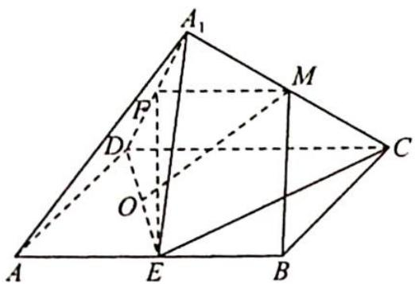
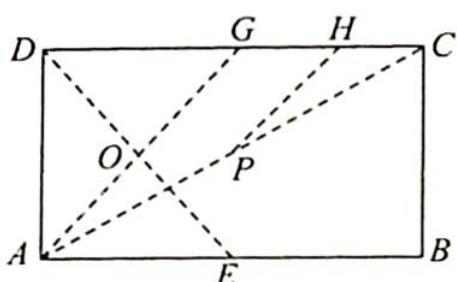

> [!faq]- 《高考数学培优40讲》例题解析
>
> > [!success]- **【答案】** C
>
> > [!note]- **【分析】**
> > 分析 ▶ A 选项: 证明 $BM \parallel$ 平面 $A_{1} D E$ 即可; B 选项: 取 $A_{1} D$ 的中点为 $F$ , 因为 $B M \parallel E F$ , 所以 $\angle A_{1} E F$ 为直线 $B M$ 与 $A_{1} E$ 所成角; C 选项: 投影到同一平面判断位置关系; D 选项: 注意 $|AO| = |DO| = |EO| = |A_{1} O|$ , 所以 $|AO|$ 为三棱锥 $A_{1}- A D E$ 外接球的半径.
>
> > [!note]- **【解析】**
> > 解析 ▶ A 选项: 如图 1 所示, 取 $A_{1} D$ 的中点为 $F$ , 四边形 BEFM 为平行四边形, 所以 $B M \parallel E F$ , 故 $B M \parallel$ 平面 $A_{1} D E$ , 则与平面 $A_{1} D E$ 垂直的直线必与 $B M$ 垂直, 即 $A$ 正确.
> > B 选项: 因为 $BM \parallel EF$ , 所以异面直线 $BM$ 与 $A_{1}E$ 所成角, 即 $\angle A_{1}EF$ 为定值, 则 B 正确.
> > C 选项: 若有 $DE \perp MO$ , 则有 $DE$ 垂直于 $MO$ 在底面的投影, 在折叠过程中, $A_{1}$ 在底面的投影轨迹为图 2 中 $AG$ , 则 $M$ 在底面的投影 $M'$ 的轨迹为 $PH$ , 由数量关系可知 $M'O$ 不可能垂直于 $DE$ , 所以 $MO$ 不可能垂直于 $DE$ , 即 C 错误.
> > D 选项: 三棱锥 $A_{1}-ADE$ 外接球的半径为 $|AO|$ , $\frac{AO}{AD}=\frac{\sqrt{2}}{2}$ , 即 D 正确.
> > 综上所述,故选 C.
> > 
> > 图1
> > 
> > 图 2
> > ## 评注
> > 本题考查空间几何体翻折、线面垂直、线线平行、异面直线垂直, 可利用“三垂线定理”, 此外还考查了外接球问题, 考查角度较综合.
