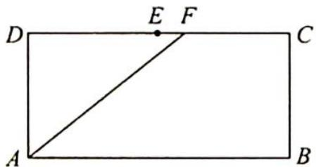
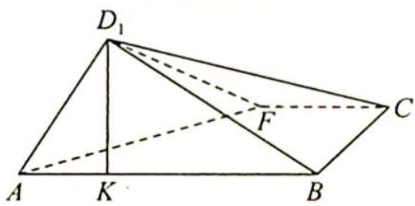
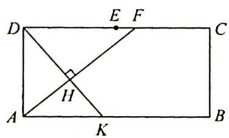
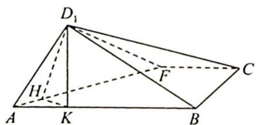

> [!faq]- 《高考数学培优40讲》例题解析
>
> > [!success]- **【答案】** 详见解析
>
> > [!note]- **【分析】**
> > 本题未单列分析。
>
> > [!note]- **【解析】**
> > 
> > 
> > ## 解析
> > 解法一: 此题的破解可采用两个极端位置法.
> > - **①**：当 F 位于 DC 的中点时, 即 F 和 E 重合, 可得 t=1.
> > - **②**：当 $F$ 点位于 $C$ 点时, 因为 $CB \perp AB$ , $CB \perp D_{1}K$ , 所以 $CB \perp$ 平面 $AD_{1}B$ , 即有 $CB \perp BD_{1}$ . 因为 $CD_{1}=2, BC=1$ , 所以 $BD_{1}=\sqrt{3}$ , 又 $AD=1$ , 因此 $AD_{1} \perp BD_{1}$ , 则 $t=\frac{1}{2}$ , 因此 $t$ 的取值范围是 $\left(\frac{1}{2}, 1\right)$ .
> > 解法二: 在长方形 ABCD 中, 过 D 作 $DH \perp AF$ , 垂足为 H, 延长 DH 与 AB 相交, 交点即为 K, 如图 1 所示.
> > 如图2所示, 因为 $D_{1} K \perp A B$ , 平面 $A B D_{1} \perp$ 平面 $A B C$ , 所以 $D_{1} K \perp$ 平面 $A B C$ , 故 $D_{1} K \perp A F$ , 又 $H K \perp A F$ , 所以 $A F \perp$ 平面 $D_{1} H K$ .
> > 由折叠过程的变换可知 $\triangle DAK \sim \triangle FDA$ , 故 $\frac{DA}{AK} = \frac{FD}{DA}$ , 所以 $AK = \frac{DA^2}{FD} = \frac{1}{FD}$ , 又 $DF \in (1, 2)$ , 故 $AK \in \left(\frac{1}{2}, 1\right)$ .
> > 
> > 图 1
> > 
> > 图 2
