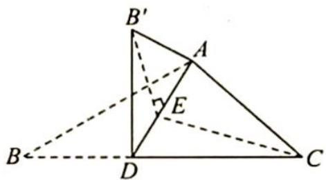
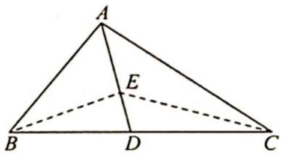

> [!faq]- 《高考数学培优40讲》例题解析
>
> > [!success]- **【答案】** 详见解析
>
> > [!note]- **【分析】**
> > 分析 ▶ 翻折以后平面 $AB^{\prime}D \perp$ 平面 ACD, 作出二面角可得到直角三角形, 再将直角边展开到平面中, 利用三角函数求最值.
>
> > [!note]- **【解析】**
> > 解析 如图1所示,作 $B^{\prime}E\perp AD$ ,连接CE, $B^{\prime}E\perp$ 平面ACD,所以 $B^{\prime}E\perp EC$ ,则 $B^{\prime}E^{2}+CE^{2}=B^{\prime}C^{2}$ .如图2所示,设 $\angle BAE=\theta$ ,则 $AE=3\cos\theta,BE=3\sin\theta$ .
> > 
> > 图 1
> > 
> > 图 2
> > 在 $\triangle ACE$ 内利用余弦定理,则 $\cos(90^{\circ}-\theta)=\frac{9\cos^{2}\theta+16-CE^{2}}{2\times4\times3\cos\theta}$ ,所以 $12\sin2\theta=9\cos^{2}\theta+16-CE^{2}$ ,故 $B^{\prime}C^{2}=B^{\prime}E^{2}+CE^{2}=BE^{2}+CE^{2}=9\cos^{2}\theta+16-12\sin2\theta+9\sin^{2}\theta=25-12\sin2\theta\geqslant13$ ,当 $\theta=\frac{\pi}{4}$ 时等号成立,取到最小值.由于 $\sin\angle ABC=\frac{4}{5}$ ,所以 $\sin\angle ADB=\sin\left(\angle ABC+\frac{\pi}{4}\right)=\frac{\sqrt{2}}{2}\left(\frac{4}{5}+\frac{3}{5}\right)=\frac{7\sqrt{2}}{10}$ .
> > 在 $\triangle ADB$ 中, $\frac{BD}{\sin\angle BAD}=\frac{AB}{\sin\angle ADB}$ ,可得 $BD=\frac{15}{7}$ .
> > 评注
> > 充分利用△ABE 翻折前后不变的性质,且利用直角三角形这个条件.
