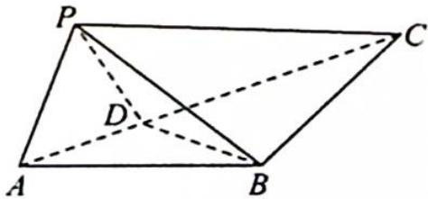
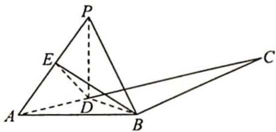

> [!faq]- 《高考数学培优40讲》例题解析
>
> > [!success]- **【答案】** 详见解析
>
> > [!note]- **【分析】**
> > 本题未单列分析。
>
> > [!note]- **【解析】**
> > 
> > 解析 ▶ 解法一: 在 $\triangle ABC$ 中, 因为 $AB=BC=2, \angle ABC=120^{\circ}$ , 易知 $AC=2\sqrt{3}, \angle BAC=$ $\angle BCA=30^{\circ}$ , 设 $AD=x$ , 则 $CD=2\sqrt{3}-x, PD=x, S_{\triangle BCD}=\frac{1}{2} \times 2 \times (2\sqrt{3}-x)\sin 30^{\circ}=\frac{2\sqrt{3}-x}{2}$ , 其中 $x \in(0,2\sqrt{3})$ .
> > 设 $P$ 点到平面 $BCD$ 的距离为 $d$ , 则 $d \leqslant x$ , 且 $V_{P-BCD} = \frac{1}{3} S_{\triangle BCD} \cdot d = \frac{1}{3} \times \frac{2\sqrt{3} - x}{2} \cdot d \leqslant$
> > $\frac{2\sqrt{3}-x}{6}\cdot x\leqslant\frac{1}{6}\times\left(\frac{2\sqrt{3}-x+x}{2}\right)^{2}=\frac{1}{2}$ ，当且仅当 $2\sqrt{3}-x=x$ ，即 $x=\sqrt{3}$ 时等号成立.
> > 故四面体 P-BCD 的体积的最大值为 $\frac{1}{2}$ .
> > 解法二: 因为 PD = DA, PB = BA, BD 为公共边, 所以 $\triangle PBD \cong \triangle ABD$ , PB = AB = 2.
> > 在 $\triangle ABC$ 中,因为 $AB=BC=2,\angle ABC=120^{\circ}$ ,易知 $\angle BAD=30^{\circ}$ ,即 $\angle BPD=30^{\circ}$ .
> > 在四面体 $P-BCD$ 中, 设 $P$ 点到平面 $BCD$ 的距离为 $d$ , 则 $V=\frac{1}{3}S_{\triangle BCD} \cdot d$ , 如图所示, 对任意定点 $D, d$ 的最大值在平面 $PBD \perp$ 平面 $BCD$ 时取得, 不妨设 $\angle ABD = \theta$ , 即 $\angle PBD = \theta$ , 则 $d = 2\sin\theta$ .
> > 
> > 在 $\triangle PBD$ 中, $\frac{BD}{\sin30^{\circ}}=\frac{2}{\sin(150^{\circ}-\theta)}$ ,所以 $BD=\frac{1}{\sin(150^{\circ}-\theta)}$ ;在 $\triangle BCD$ 中, $S_{\triangle BCD}=\frac{1}{2}\cdot BC \cdot BD \cdot \sin(120^{\circ}-\theta)=\frac{\sin(120^{\circ}-\theta)}{\sin(150^{\circ}-\theta)}$ .
> > 故四面体 $P - BCD$ 的体积 $V = \frac{1}{3} \times \frac{\sin(120^{\circ} - \theta)}{\sin(150^{\circ} - \theta)} \cdot 2\sin\theta = \frac{2}{3} \times \frac{\sin\theta\sin(\theta + 60^{\circ})}{\sin(\theta + 30^{\circ})} = \frac{1}{3} \times \frac{-[\cos(2\theta + 60^{\circ}) - \cos 60^{\circ}]}{\sin(\theta + 30^{\circ})} = -\frac{1}{3} \times \frac{(1 - 2\sin^{2}(\theta + 30^{\circ}) - \frac{1}{2})}{\sin(\theta + 30^{\circ})} = \frac{1}{3} \times \frac{2\sin^{2}(\theta + 30^{\circ}) - \frac{1}{2}}{\sin(\theta + 30^{\circ})} = \frac{1}{3} \times [2\sin(\theta + 30^{\circ}) - \frac{1}{2\sin(\theta + 30^{\circ})}].$
> > 令 $t=2\sin(\theta+30^{\circ})$ ，因为 $0^{\circ}<\theta<120^{\circ}$ ，所以 $t\in(1,2]$ .
> > 又函数 $y = \frac{1}{3}\left(t - \frac{1}{t}\right)$ 在(1,2]上单调递增，当 $t = 2$ 时， $y_{\max} = \frac{1}{2}$ .
> > 故四面体 P-BCD 体积的最大值为 $\frac{1}{2}$ .
