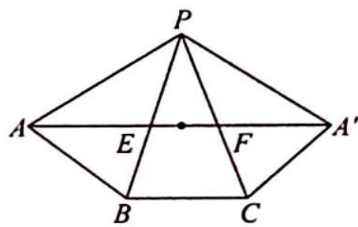

> [!faq]- 《高考数学培优40讲》例题解析
>
> > [!success]- **【答案】** A
>
> > [!note]- **【分析】**
> > 分析 ▶ △AEF 周长的最小值, 也就是线段 AE, EF, FA 之和的最小值, 将三棱锥沿侧棱 PA 展开, 转化为两点之间线段最短求最值.
>
> > [!note]- **【解析】**
> > 解析 ▶ 将正三棱锥 P-ABC 沿侧棱 PA 剪开展平如图所示, 显然当 A, E, F, $A'$ 四点共线时, $\triangle AEF$ 周长最小, 最小值为线段 $AA'$ 的长, 在 $\triangle PAA'$ 中, $PA = PA' = 2\sqrt{3}$ , $\angle APA' = 120^{\circ}$ , 由余弦定理得 $AA' = 6$ . 故选 A.
> > 
