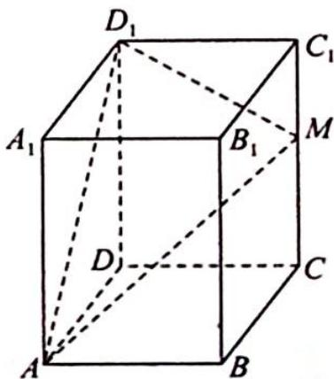
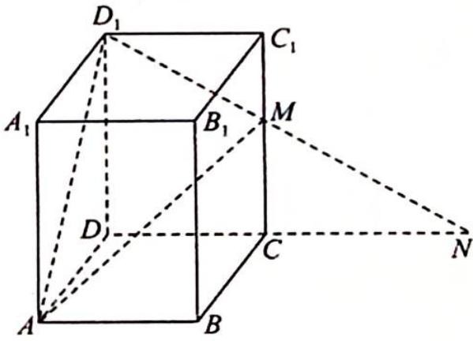

> [!faq]- 《高考数学培优40讲》例题解析
>
> > [!success]- **【答案】** 详见解析
>
> > [!note]- **【分析】**
> > 本题未单列分析。
>
> > [!note]- **【解析】**
> > 
> > 解析 因为 $AB=1, BC=\sqrt{3}$ ，所以 AC=2，如图所示，延长 DC 到 N 使得 CN=AC=2，则 MA=MN.
> > 设 $CC_{1} = h$ ，连接 $D_{1}N$ 交 $CC_{1}$ 于 $M$ ，则 $MD_{1} + MA$ 的最小值为 $D_{1}N = \sqrt{h^{2} + 9}$ ，因为 $\frac{MC}{DD_1} = \frac{CN}{DN} = \frac{2}{3}$ ，所以 $CM = \frac{2h}{3},C_1M = \frac{h}{3}$ ，则 $D_{1}M = \sqrt{D_{1}C_{1}^{2} + C_{1}M^{2}} = \sqrt{1 + \frac{h^{2}}{9}},AM = \sqrt{4 + \frac{4h^{2}}{9}}.$
> > 
> > 又 $AD_{1} = \sqrt{3 + h^{2}}$ ， $MA\bot MD_1$ ，所以 $AD_{1}^{2} = MA^{2} + MD_{1}^{2}$ ，即 $3+$ $h^2 = 1 + \frac{h^2}{9} +4 + \frac{4h^2}{9}$ ，解得 $h = \frac{3\sqrt{2}}{2}$ ，即棱 $CC_{1}$ 的长为 $\frac{3\sqrt{2}}{2}$
> > 本题通过翻折将点 A, M, $D_{1}$ 放到一个平面中，进而利用相似设出边长，求解.
