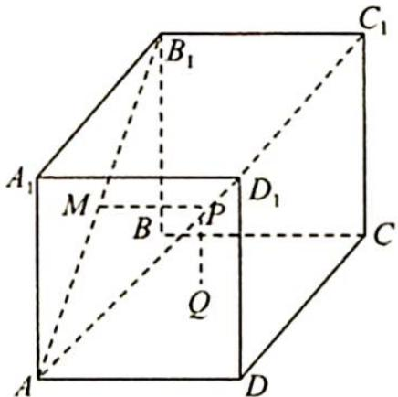
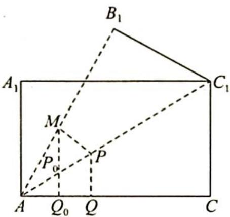

> [!faq]- 《高考数学培优40讲》例题解析
>
> > [!success]- **【答案】** C
>
> > [!note]- **【分析】**
> > 分析 ▶ $AC_{1}$ 上的动点 P 到底面 ABCD 上的点 Q 的最小值为 P 到底面 ABCD 上的投影的距离, 即 Q 在直线 AC 上. 故需把 $\triangle AB_{1}C_{1}$ 绕 $AC_{1}$ 旋转, 使 $\triangle AB_{1}C_{1}$ 和 $\triangle ACC_{1}$ 平铺在一个平面内, 由垂线段最短知 $MP + PQ$ 的最小值为过点 M 向 AC 作垂线的垂线段长度.
>
> > [!note]- **【解析】**
> > 解析 ▶ 先确定只有 $PQ \perp$ 底面时, PQ 最小, 如图所示, 将 $\triangle AB_{1}C_{1}$ 沿 $AC_{1}$ 翻折使得 A, $B_{1}, C_{1}, C$ 四点共面, 则 $MP + PQ \geqslant MP_{0} + P_{0}Q_{0} = MQ_{0}$ .
> > 
> > 
> > 设 $\angle CAC_{1}=\theta$ ,则 $\tan\theta=\frac{1}{\sqrt{3}}$ ,所以 $\theta=30^{\circ}$ ,而 $AM=\frac{\sqrt{3}}{2}$ ,则 $MQ_{0}=\frac{3}{4}$ .
> > 过点 $M$ 作 $MQ\perp AC$ 于点 $Q$ 时, $MP+PQ$ 有最小值,最小值为 $\frac{3}{4}$ .故选C.
> > 本题先确定点 $Q$ , 再分析题意, 将几个点放到一个平面中分析, 利用三点共线及点到直线距离垂线段最短求解.
