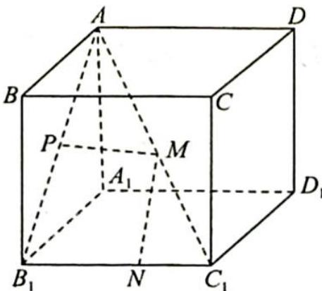
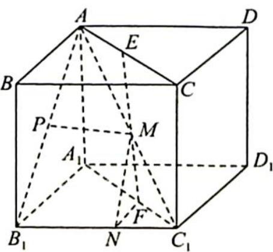

> [!faq]- 《高考数学培优40讲》例题解析
>
> > [!success]- **【答案】** D
>
> > [!note]- **【分析】**
> > 本题未单列分析。
>
> > [!note]- **【解析】**
> > 
> > 解析 如图所示, 取 $AC$ 的中点 $E$ , 过 $M$ 作 $MF$ 垂直于平面 $A_{1}B_{1}C_{1}D_{1}$ , 易知 $\triangle APM \cong \triangle AEM$ , 故 $PM = EM$ , 而对固定点 $M$ , 当 $MN \perp B_{1}C_{1}$ 时, $MN$ 最小, 此时 $MF$ 垂直于平面 $A_{1}B_{1}C_{1}D_{1}$ , 易得 $\angle MNF = 45^{\circ}$ , $MF = NF$ , 可知 $\triangle MNF$ 为等腰直角三角形, $MF = \frac{\sqrt{2}}{2} MN$ , 故 $2PM +$ $\sqrt{2} MN = 2\left(PM + \frac{\sqrt{2}}{2} MN\right) = 2(EM + MF) \geqslant 2AA_{1} = 2.$ 故选D.
> > 
> > ## 评注
> > 本题关键在于将 $2PM + \sqrt{2} MN$ 转化为 $2(EM + MF)$ , 此时线段系数相同, 利用三点共线即可得出答案.
