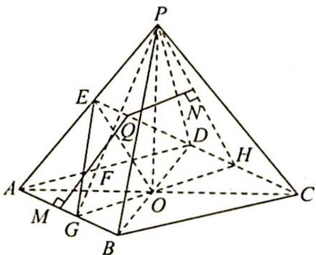
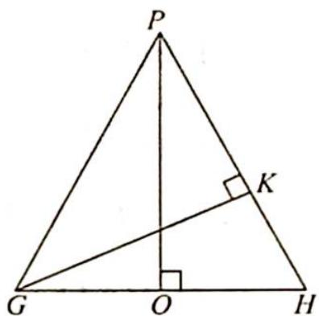

> [!faq]- 《高考数学培优40讲》例题解析
>
> > [!success]- **【答案】** 详见解析
>
> > [!note]- **【分析】**
> > 本题未单列分析。
>
> > [!note]- **【解析】**
> > 解析 (1)如图1所示,在三棱锥P-ABC中,取AC中点为O,因为PA=PB=PC,所以P在平面ABC上的投影为等腰直角三角形ABC的外心,即为O,则PO⊥平面ABC.
> > 因为 $AC=2\sqrt{2}$ , PA=3, 所以 $PO=\sqrt{7}$ , 又 E 为 PA 中点, 所以 E 到平面 ABC 的距离为 $\frac{\sqrt{7}}{2}$ .
> > 
> > 图 1
> > 
> > 图 2
> > (2)如图1所示,延长BO到D,使得 ${BD} = {AC} = 2\sqrt{2}$ ,连接 ${AD},{CD},{PD}$ ,则 ${AD} = {DC} = 2$ , ${PD} = 3$ ,四棱锥P-ABCD为正四棱锥,所以点Q到平面PBC的距离等于到平面PCD的距离.
> > 过 $Q$ 作 $QN \perp$ 平面 $PCD$ , 垂足为 $N$ , 则 $d_{1} = QN$ , 过 $Q$ 作 $QM \perp AB$ , 垂足为 $M$ , 则 $d_{2} = QM$ , $d_{1} + d_{2}$ 表示直线 $CE$ 上动点 $Q$ 到直线 $AB$ 与到平面 $PCD$ 的距离之和.
> > 又 $AB \parallel$ 平面 $PCD$ , 故 $d_{1} + d_{2}$ 的最小值为直线 $AB$ 到平面 $PCD$ 的距离.
> > 取 AB 中点 G, CD 中点 H, 则平面 $PGH \perp$ 平面 PCD; 过 G 作 $GK \perp PH$ , 垂足为 K, 如图 2 所示, 则 $d_{1} + d_{2} \geqslant GK$ .
> > 在 $\triangle PGH$ 中， $GK = \frac{GH \cdot OP}{PH} = \frac{2 \times \sqrt{7}}{2\sqrt{2}} = \frac{\sqrt{14}}{2}$ ，故 $d_{1} + d_{2}$ 的最小值为 $\frac{\sqrt{14}}{2}$ .
