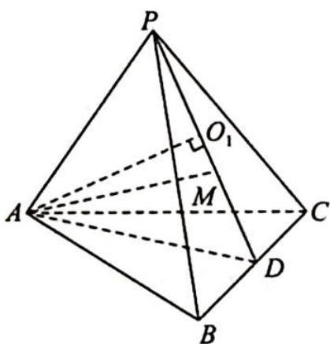
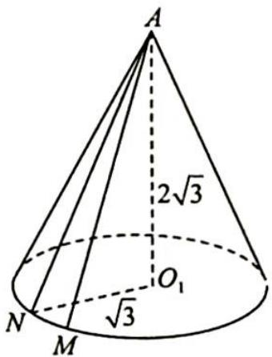

> [!faq]- 《高考数学培优40讲》例题解析
>
> > [!success]- **【答案】** D
>
> > [!note]- **【分析】**
> > 分析 ▶ 点 M 在平面 PBC 内, 点 A 到平面 PBC 的距离小于 AM, 所以 M 的运动轨迹可以看作平面 PBC 上的圆, 与点 A 构成圆锥.
>
> > [!note]- **【解析】**
> > 解析 如图1所示,取BC的中点D,连接PD,AD,则 $PD \perp BC$ , $AD \perp BC$ , 所以 $BC \perp$ 平面PAD, 故平面 $PBC \perp$ 平面PAD. 过A作 $AO_{1} \perp PD$ , 则 $AO_{1} \perp$ 平面PBC, 垂足为 $O_{1}$ , 由已知可得 $AO_{1} = 4 \times \frac{\sqrt{3}}{2} = 2\sqrt{3}$ , 为定值, 又 $AM = \sqrt{15}$ , 所以 $O_{1}M = r$ 为定值, r = $\sqrt{(\sqrt{15})^{2} - (2\sqrt{3})^{2}} = \sqrt{3}$ , 即M的轨迹为圆 $O_{1}$ , 如图2所示, 异面直线AM与BC所成的角 $\alpha$ 的最小值为圆锥母线与底面所成角, 则 $\cos\alpha$ 的最大值为 $\frac{\sqrt{5}}{5}$ . 故选D.
> > 
> > 图1
> > 
> > 图2
