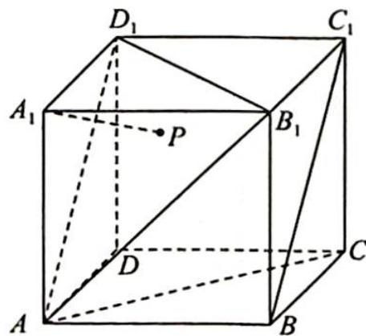
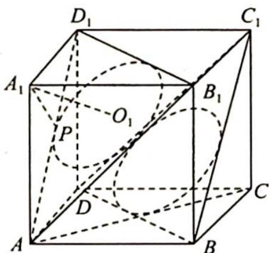
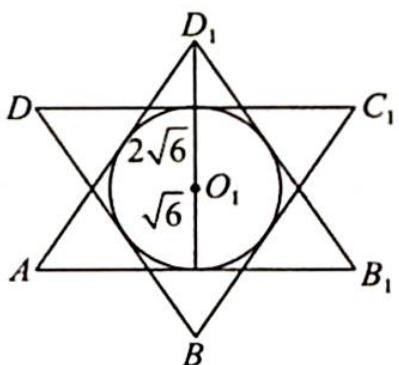

> [!faq]- 《高考数学培优40讲》例题解析
>
> > [!success]- **【答案】** B
>
> > [!note]- **【分析】**
> > 本题未单列分析。
>
> > [!note]- **【解析】**
> > 
> > 解析 ▶ 过点 $A_{1}$ 作 $A_{1}O_{1}$ 垂直平面 $AB_{1}D_{1}$ 于点 $O_{1}$ , 则点 $A_{1}$ 到平面 $AB_{1}D_{1}$ 的距离为 $A_{1}O_{1}$ , 如图 1 所示, $V_{A_{1}AB_{1}D_{1}} = \frac{1}{3} \times \frac{1}{2} \times 6 \times 6 \times 6 = \frac{1}{3} \times \frac{\sqrt{3}}{4} \times (6\sqrt{2})^{2} \cdot A_{1}O_{1}, A_{1}O_{1} = \frac{108}{\frac{\sqrt{3}}{4} \times 72} = \frac{108}{18\sqrt{3}} = 2\sqrt{3}$ .
> > $A_{1}P=3\sqrt{2},r=\sqrt{(3\sqrt{2})^{2}-(2\sqrt{3})^{2}}=\sqrt{6}$ ，所以点P的轨迹是以点 $O_{1}$ 为圆心、r为半径的圆，即为三角形 $AB_{1}D_{1}$ 的内切圆 $O_{1}$ .
> > 如图2所示,将圆 $O_{1}$ 投影到平面 $BC_{1}D$ ,由此可知 $BC_{1}$ 上的切点与圆 $O_{1}$ 上对应点之间的距离为点P到 $BC_{1}$ 距离的最小值,即平面 $AD_{1}B_{1}$ 与平面 $DC_{1}B$ 之间的距离,所以 $\frac{1}{3}\times6\sqrt{3}=2\sqrt{3}$ .故选B.
> > 
> > 图1
> > 
> > 图 2
