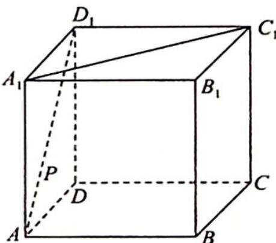
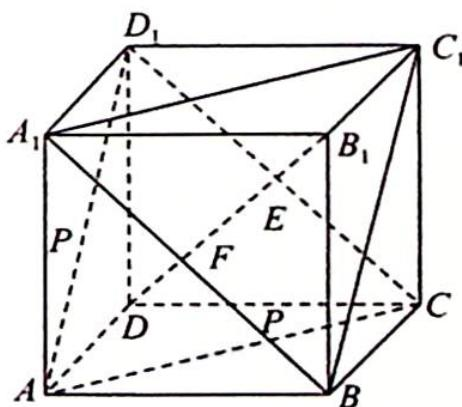

> [!faq]- 《高考数学培优40讲》例题解析
>
> > [!success]- **【答案】** D
>
> > [!note]- **【分析】**
> > 本题未单列分析。
>
> > [!note]- **【解析】**
> > 
> > 解析 ▶ 由题意知,动点 P 到直线 $A_{1}C_{1}$ 的最小距离为异面直线 $AD_{1}$ 与 $A_{1}C_{1}$ 的距离.
> > 由正方体性质知 $P \in AD_{1}, P \in$ 平面 $AD_{1}C$ , 又 $A_{1}C_{1} \subset$ 平面 $A_{1}BC_{1}$ , 且 $AD_{1} \parallel$ 平面 $A_{1}BC_{1}$ , 平面 $AD_{1}C \parallel$ 平面 $A_{1}BC_{1}$ , 所以异面直线 $AD_{1}$ 与 $A_{1}C_{1}$ 的距离等于两平行平面之间的距离 $d$ .
> > 又体对角线 $B_{1}D \perp$ 平面 $AD_{1}C$ , 且 $BD_{1} = \sqrt{3}$ , 所以 $d = \frac{\sqrt{3}}{3}$ . 故选 D.
> > 注:如图所示,设 $B_{1}D \cap$ 平面 $A_{1}BC_{1} = E$ , $B_{1}D \cap$ 平面 $AD_{1}C = F$ , 则 $EF = B_{1}E = FD = \frac{1}{3}B_{1}D.$
> > 
