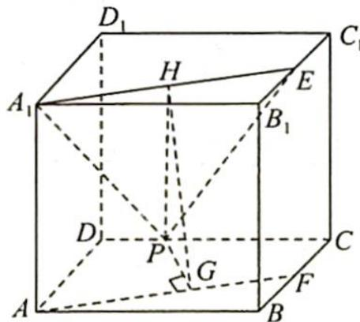

> [!faq]- 《高考数学培优40讲》例题解析
>
> > [!success]- **【答案】** 详见解析
>
> > [!note]- **【分析】**
> > 分析 ▶ ①: 判断点 P 是否在 $A_{1}E$ 的中垂面上; ②: 作出三角形 $PA_{1}E$ 的以 $A_{1}E$ 为底边的高线, 放在直角三角形中分析长度变化; ③: 将四面体 $A_{1}-PB_{1}E$ 看作是以 P 为顶点的棱锥, 分析体积变化.
>
> > [!note]- **【解析】**
> > 解析 ①: 线段 $A_{1}E$ 的中垂面显然与 $CD$ 有交点, 则存在点 $P$ 使得 $PA_{1}=PE$ , 故①正确.
> > - **②**：如图所示,将 $A_{1}E$ 投影到底面ABCD中可得到AF,过P作 $PG \perp AF$ 于点G,G投影到平面 $A_{1}B_{1}C_{1}D_{1}$ 上为点H,连接PH,则 $PH \perp A_{1}E$ , $PH^{2}=PG^{2}+HG^{2}$ ,随着动点P沿着棱DC从点D向点C运动时,PG越来越小,因此PH也随之越来越小,所以 $\triangle PA_{1}E$ 的面积越来越小,故②正确.
> > 
> > - **③**：$V_{A_1 - PB_1E} = V_{P - A_1B_1E} = \frac{1}{3} S_{\triangle A_1B_1E} \cdot d$ ( $d$ 为点 $P$ 到平面 $A_1B_1E$ 的距离), 又 $S_{\triangle A_1B_1E} = \frac{1}{2} |A_1B_1||B_1E|$ 保持不变, $d$ 也保持不变, 所以 $V_{A_1 - PB_1E}$ 不变, 故③正确.
> > 综上所述,所有正确的结论的序号为①②③.
