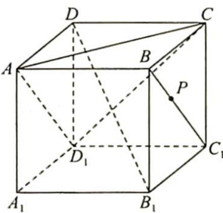

> [!faq]- 《高考数学培优40讲》例题解析
>
> > [!success]- **【答案】** D
>
> > [!note]- **【分析】**
> > 本题未单列分析。
>
> > [!note]- **【解析】**
> > 
> > 其中正确的命题是( ). A. ①② B. ①②③ C. ②④ D. ①②④
> > 解析 ▶ ①: 因为 $B_{1}D \perp$ 平面 $ACD_{1}, B_{1}D \subset$ 平面 $PB_{1}D$ ，所以平面 $PB_{1}D \perp$ 平面 $ACD_{1}$ ，故①正确。
> > - **②**：易知平面 $ACD_{1} \parallel$ 平面 $A_{1}BC_{1}, A_{1}P \subset$ 平面 $A_{1}BC_{1}$ ，所以 $A_{1}P \parallel$ 平面 $ACD_{1}$ ，故②正确.
> > - **③**：因为 $AD_{1} \parallel BC_{1}$ ，异面直线 $A_{1}P$ 与 $AD_{1}$ 所成角等于 $BC_{1}$ 与 $A_{1}P$ 所成角，其范围为 $\left[\frac{\pi}{3}, \frac{\pi}{2}\right]$ ，所以③错误.
> > - **④**：因为 $BC_{1} \parallel$ 平面 $AD_{1}C$ ，设点 P 到平面 $AD_{1}C$ 的距离为 d，则 $V_{D_{1}-APC} = \frac{1}{3} S_{\triangle AD_{1}C} \cdot d$ 保持不变，所以④正确.
> > 综上所述,
> >
> > 故选 **D**.
