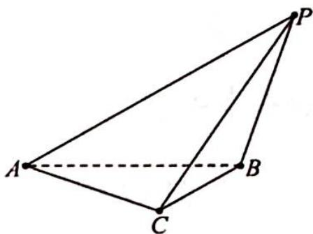
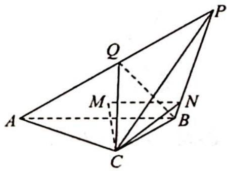
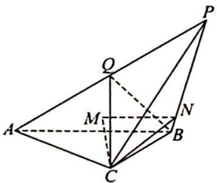

> [!faq]- 《高考数学培优40讲》例题解析
>
> > [!success]- **【答案】** B
>
> > [!note]- **【分析】**
> > 本题未单列分析。
>
> > [!note]- **【解析】**
> > 
> > ⊥平面 $PAB$ ;
> > - **③**：设 $\triangle PAC$ 的面积为 $S$ , 则 $S$ 的取值范围是 $(0,4]$ ;
> > - **④**：设二面角 $A-PB-C$ 的大小为 $\alpha$ , 则 $\alpha$ 的取值范围是 $\left(0, \frac{\pi}{4}\right]$ . 其中正确结论是 ( ). A. ①③ B. ①④ C. ②③ D. ②④
> > 解析 ▶ 由已知得 $AB=2\sqrt{2}, PA=4.$
> > - **①**：当 $PB \perp BC$ 时, $PC = 2\sqrt{3}$ , $PB \perp$ 平面 $ABC$ , 所以 $AC \perp PB$ . 又 $AC \perp BC$ , 所以 $AC \perp$ 平面 $PBC$ , 则平面 $PAC \perp$ 平面 $PBC$ . 故①正确.
> > - **②**：如图1所示,取PA中点Q,连接BQ,QC,若平面PAC⊥平面PAB,则BQ⊥PA,BQ⊥平面PAC,∠BQC=90°.于是BQ= $\frac{1}{2}$ PA=2,又BC=2,斜边与直角边相等,矛盾.故②不正确.
> > 
> > - **③**：$S_{\triangle PAC} = \frac{1}{2} AP \cdot AC \sin \angle PAC = 4 \sin \angle PAC$ , 因为 $\angle PAB = 45^{\circ}$ , 图1 $\angle BAC = 45^{\circ}$ , 且 $AC, AB, AP$ 不在同一平面上, 所以 $\angle PAC < 90^{\circ}$ , 故 $\sin \angle PAC \in (0,1), S \in (0,4)$ , 取不到最大值4. 故③错误.
> > - **④**：如图2所示, 过 $C$ 作 $CM \perp$ 平面 $PAB$ , 垂足为 $M$ , 则 $M$ 一定在 $AB$ 的中垂线上, 再过 $M$ 作 $MN \perp PB$ , 则 $MN = \sqrt{2}$ . 连接 $NC$ , 则 $\angle CNM$ 为二面角 $A - PB - C$ 的平面角, 在 Rt $\triangle CMN$ 中, $\tan \alpha = \frac{CM}{MN} = \frac{CM}{\sqrt{2}}$ , $CM \in (0, \sqrt{2}]$ , 所以 $\tan \alpha \in (0, 1]$ , 故 $\alpha \in \left(0, \frac{\pi}{4}\right]$ , ④ 正确.
> > 
> > 图2
> > 综上所述，①④正确，
> >
> > 故选 **B**.
