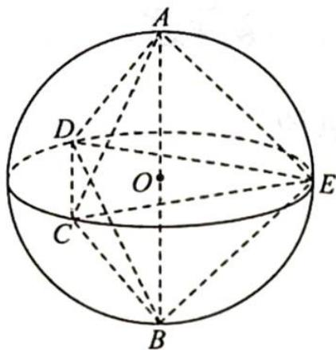

> [!faq]- 《高考数学培优40讲》例题解析
>
> > [!success]- **【答案】** C
>
> > [!note]- **【分析】**
> > 分析 如图所示, 取 $AB$ 的中点为 $O$ , 连接 $OC, OD, OE$ , 则 $OC = OD = OE = 5$ , 故该多面体的顶点都在以 $AB$ 为直径的球面上.
>
> > [!note]- **【解析】**
> > 解析 如图所示,在球 O 中,AB 为直径, $\triangle CDE$ 的外接圆圆心为 $O'$ .
> > 设 A, B 到平面 CDE 的距离分别为 $d_{1}, d_{2}$ ，则多面体 ABCDE 的体积 $V = \frac{1}{3} S_{\triangle CDE} (d_{1} + d_{2}) \leqslant \frac{1}{3} S_{\triangle CDE} \cdot AB.$
> > 设圆 $O'$ 的半径为 $r$ , 则 $3 \leqslant r \leqslant 5$ , 又点 $E$ 到 $CD$ 的最大距离 $d = r + \sqrt{r^2 - 9}$ , 所以 $\triangle CDE$ 的面积 $S_{\triangle CDE} = \frac{1}{2} CD \cdot d \leqslant \frac{1}{2} \times 6 (r + \sqrt{r^2 - 9})$ .
> > 
> > 显然函数 $f(x) = 3(r + \sqrt{r^2 - 9})$ 在[3,5]上单调递增，故 $S_{\triangle CDE}$ 的最大值为 $3 \times (5 + \sqrt{25 - 9}) = 27$ .
> > 所以该多面体的体积最大值 $V_{max}=\frac{1}{3}\times27\times10=90$ .
> >
> > 故选 **C**.
