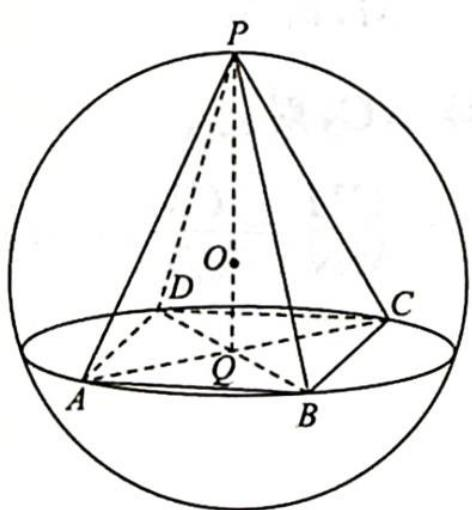
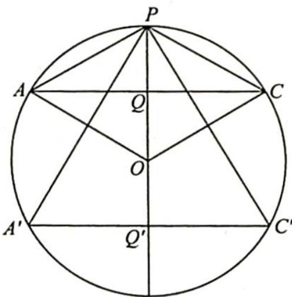
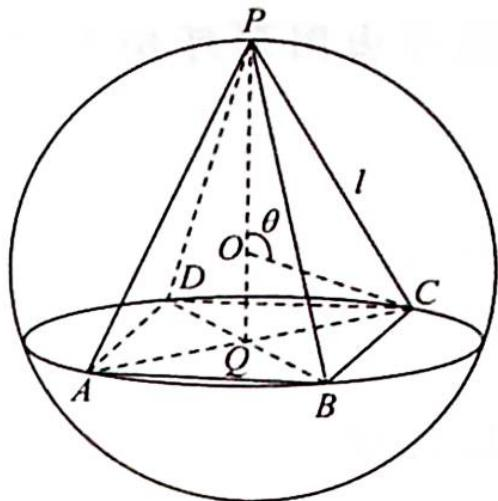

> [!faq]- 《高考数学培优40讲》例题解析
>
> > [!success]- **【答案】** C
>
> > [!note]- **【分析】**
> > 本题未单列分析。
>
> > [!note]- **【解析】**
> > 解析 ▶ 解法一:如图1所示,设正四棱锥顶点为P,底面为正方形ABCD,底面中心为Q,球心为O,则OP=R,PA=PB=PC=PD=l∈[3,3√3].连接AC与BD,交点为Q,则OQ⊥平面ABCD.
> > 因为球 O 的体积为 $36\pi=\frac{4}{3}\pi R^{3}$ ，所以 R=3，设 PQ=h，底面边长为 a，则 $V_{P-ABCD}=\frac{1}{3}\times a^{2}\cdot h$ .
> > 
> > 图1
> > 
> > 图2
> > 如图2所示，由 $(h - R)^2 +\left(\frac{\sqrt{2}}{2} a\right)^2 = 9$ 得 $a^2 = 2(6h - h^2)$ ，又 $l^2 = h^2 +\left(\frac{\sqrt{2}}{2} a\right)^2 = \frac{a^2}{2} +h^2 =$ $6h\in [9,27]$ ，解得 $\frac{3}{2}\leqslant h\leqslant \frac{9}{2}$
> > 所以 $V(h)=\frac{2}{3}h(6h-h^{2})=-\frac{2}{3}h^{3}+4h^{2}, V^{\prime}=-2h^{2}+8h=-2h(h-4)$ ，则 $V(h)$ 在 $\left[\frac{3}{2},4\right]$ 上单调递增，在 $\left[4,\frac{9}{2}\right]$ 上单调递减， $V_{\min}=V\left(\frac{3}{2}\right)=\frac{27}{4}, V_{\max}=V(4)=\frac{64}{3}$ 。故选 C.
> > 解法二: 因为 $V_{球}=\frac{4}{3}\pi R^{3}=36\pi$ ，所以 R=3.
> > 如图3所示，设正四棱锥P-ABCD的外接球球心为O，则OP=OC=3.
> > 令 $\angle POC=\theta$ ，因为 $PC=l\in[3,3\sqrt{3}]$ ，所以 $\theta\in\left[\frac{\pi}{3},\frac{2\pi}{3}\right]$ .
> > 设底面 ABCD 的边长为 a，则 $|QC|=3\sin\theta$ ，所以 $a=3\sqrt{2}\sin\theta,h=PQ|=3-3\cos\theta.$
> > 
> > 图 3
> > 所以该四棱锥的体积 $V = \frac{1}{3} Sh = \frac{1}{3} a^2 h = \frac{1}{3} \times 18\sin^2\theta (3 - 3\cos \theta) = 18\sin^2\theta (1 - \cos \theta) = 18(1 - \cos^2\theta)(1 - \cos \theta) = 18(1 + \cos \theta)(1 - \cos \theta)^2 = 72(1 + \cos \theta)\left(\frac{1}{2} -\frac{1}{2}\cos \theta\right)^2\leqslant 72\times \left(\frac{2}{3}\right)^3 = 72\times \frac{8}{27} = \frac{64}{3}$ 当且仅当 $1 + \cos \theta = \frac{1}{2} -\frac{1}{2}\cos \theta$ ，即 $\frac{3}{2}\cos \theta = -\frac{1}{2},\cos \theta = -\frac{1}{3}$ 时， $V_{\mathrm{max}} = \frac{64}{3}$ 当 $\theta = \frac{\pi}{3}$ 时， $V = 18\times \frac{3}{4}\times \frac{1}{2} = \frac{27}{4}$ 当 $\theta = \frac{2\pi}{3}$ 时， $V = 18\times \frac{3}{4}\times \frac{3}{2} = \frac{81}{4}$ 故 $V_{\min} = \frac{27}{4}$ 综上所述， $\frac{27}{4}\leqslant V_{P - ABCD}\leqslant \frac{64}{3}$ .
> >
> > 故选 **C**.
