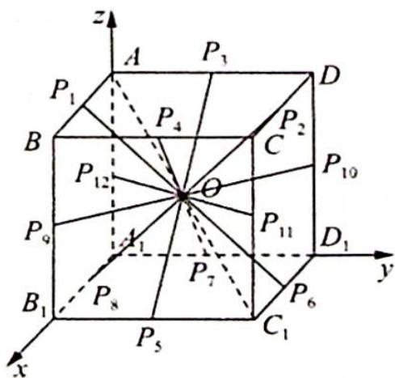

> [!faq]- 《高考数学培优40讲》例题解析
>
> > [!success]- **【答案】** C
>
> > [!note]- **【分析】**
> > 本题未单列分析。
>
> > [!note]- **【解析】**
> > 解析 如图所示, 建立空间直角坐标系 $A_{1} - xyz$ , 则可得 $A(0,0,2)$ , $C_{1}(2,2,0)$ , $O$ 为 $AC_{1}$ 的中点, 其坐标为 $(1,1,1)$ , $\overrightarrow{PC_1} \cdot \overrightarrow{PA} = \overrightarrow{PO^2} - \frac{1}{4} \overrightarrow{AC_1}^2 = \overrightarrow{PO^2} - \frac{1}{4} (2^2 + 2^2 + 2^2) = \overrightarrow{PO^2} - \frac{1}{4} \times 12 = \overrightarrow{PO^2} - 3 = -1$ , 所以 $|\overrightarrow{PO}| = \sqrt{2}$ .
> > 
> > 由图形可知正方体 12 条棱的中点 $P_{1}, \cdots, P_{12}$ 均满足 $\left|OP_{i}\right| = \sqrt{2} (i = 1, 2, \cdots, 12)$ .
> >
> > 故选 **C**.
