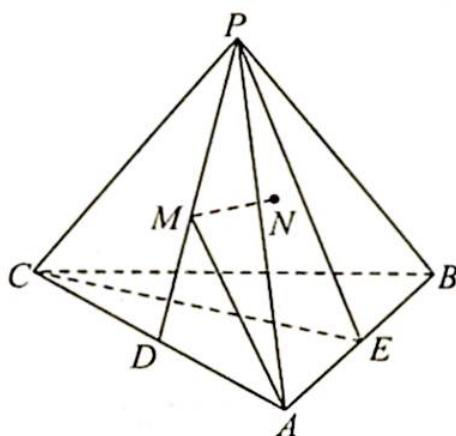

<!-- question-source:start -->
2. 如图所示, 已知正三棱锥 $P-ABC$ 中, 侧棱长为 $\sqrt{2}$ , 底面边长为 $2, D$ 为 $AC$ 中点, $E$ 为 $AB$ 中点, $M$ 是 $PD$ 上的动点, $N$ 是平面 $PCE$ 上的动点, 则 $AM+MN$ 的最小值是 ( ).

A. $\frac{\sqrt{2}+\sqrt{6}}{4}$ B. $\frac{1+\sqrt{3}}{2}$ C. $\frac{\sqrt{6}}{4}$ D. $\frac{\sqrt{3}}{2}$

<!-- question-source:end -->

![[Q00020084A1]]
