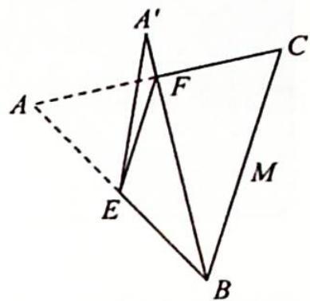

<!-- question-source:start -->
6. 如图所示, 在正 $\triangle ABC$ 中, $AB = a$ , $EF \parallel BC$ , 把 $\triangle AEF$ 沿 $EF$ 折起, 使平面 $A'EF \perp$ 平面 $BCFE$ , 求当 $EF$ 离 $BC$ 多远时, $A'B$ 的长度最小?

<!-- question-source:end -->

![[Q00020088A1]]
