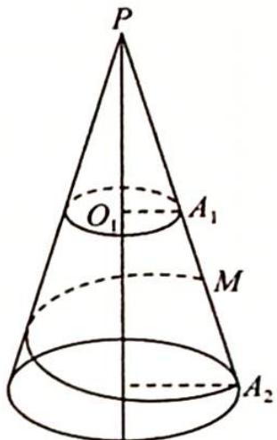

<!-- question-source:start -->
7. 如图所示, 已知一圆台上底半径 $r_1 = 5 \mathrm{~cm}$ , 下底半径 $r_2 = 10 \mathrm{~cm}$ , 母线

$A_{1}A_{2}=20cm$ ，从 $A_{1}A_{2}$ 的中点M拉一根绳子，围绕圆台侧面转到下底圆周上的点 $A_{2}$ .

(1)求绳子的最短长度；

(2)当绳子最短时,求绳子上的点与上底圆周上点的连线的最小长度.
<!-- question-source:end -->

![[Q00020089A1]]
